# 介绍

本教程介绍在openhands中Agent如何与大模型交互

# 本课涵盖以下内容

- 如何配置大模型API的参数（model、api_key、base_url、temperature等）
- Agent如何访问大模型API

# 配置大模型API的参数

在openhands工程根目录打开config.toml文件，内容如下：
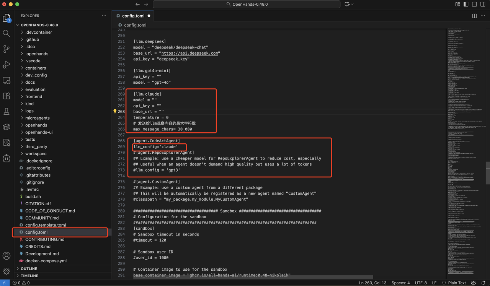

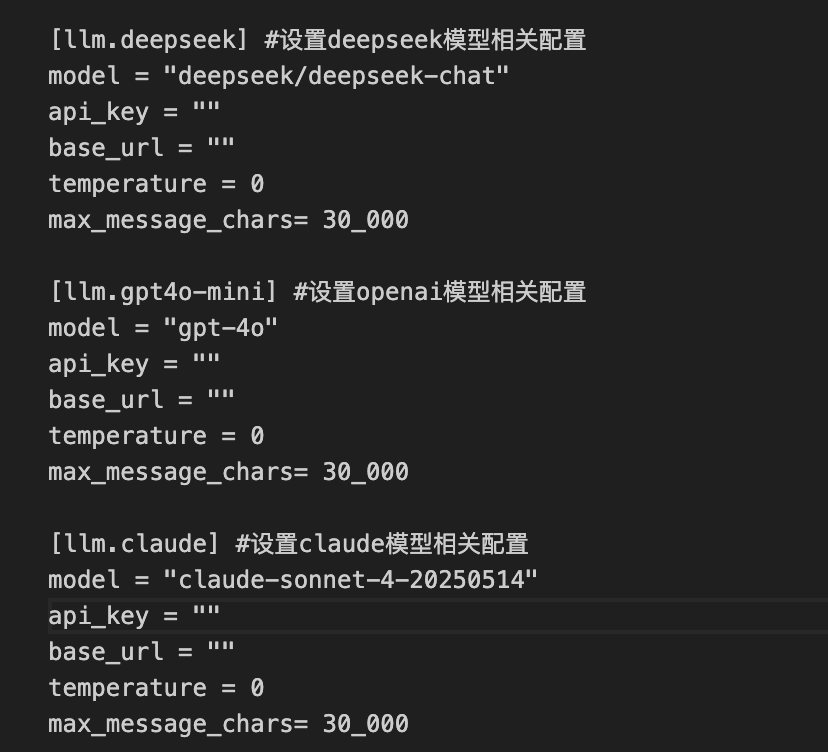

## LLM-配置说明：

- **model**：访问的大语言模型名称，例如 `gpt-4o`、`gpt-3.5-turbo` 等。 用于指定调用哪个模型进行推理。
- **base_url**：大模型 API 的基础访问地址。 通常是模型服务的接口域名，如 `https://api.openai.com/v1`。
- **api_key**：访问大模型 API 所需的密钥，用于身份验证与访问授权。 请妥善保管，避免泄露。
- **Temperature**：模型输出的“温度值”，控制生成结果的**随机性**。 值越小，输出更稳定、确定；值越大，输出更丰富、多样。 常用范围：`0.2–1.0`。
- **max_message_chars**：模型返回内容的最大字符数限制。 openhands 会根据该值对大模型返回的文本进行截断，防止输出过长。

## Agent-配置说明：

- **llm_config**: 填写已经预设的配置信息，只需填写[llm.xxx]中的名称
  -  例如
  -  [llm.deepseek]
  -  model="xxx"
  -  base_url="xxx"
  -  那么llm_config则只需要填写为deepseek即可

## model参数配置说明：

OpenHands 通过 **LiteLLM** 调用大模型；因此 **model** 必须写成 **[LiteLLM 支持的模型标识](https://docs.litellm.ai/docs/providers)**

- **Deepseek**
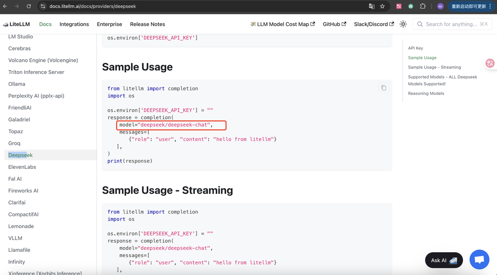

- **Qwen**
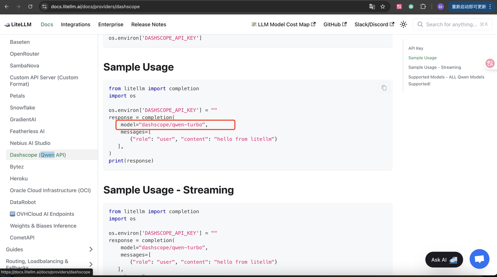

- **OpenAI**
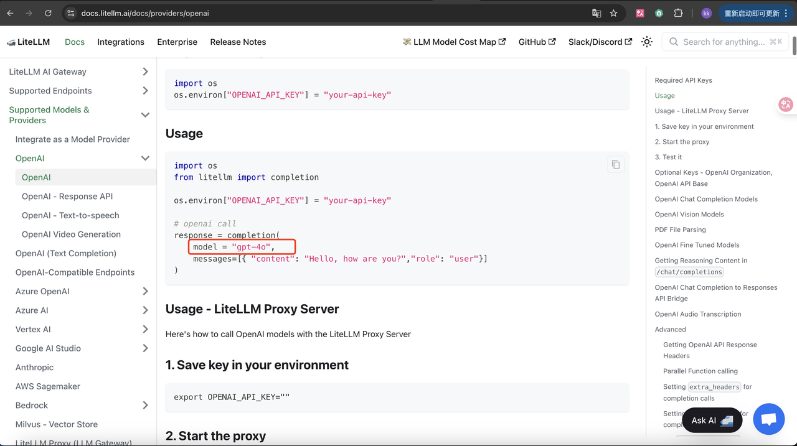

- **Anthropic**
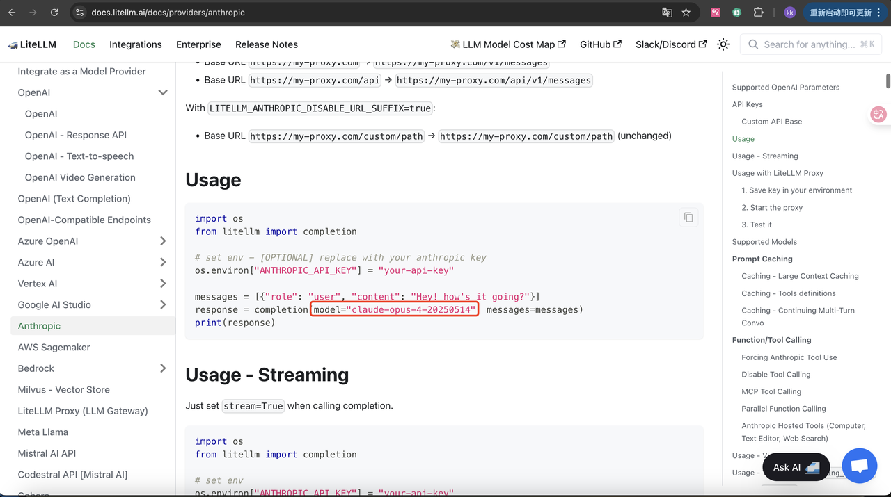

# Agent如何访问大模型

在openhands/agenthub/codeact_agent/codeact_agent.py文件第190行开始访问大模型，大致流程：
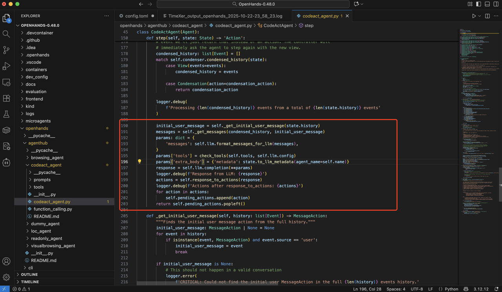

1. 先从state.history(记录了与大模型交互的所有action和observation的内容)中获取用户初始消息（Agent创建时传入第一个消息user prompt即为task.txt中的内容）
2. 获取所有memory中的历史记录
3. 创建params参数（访问大模型时传入的参数内容）
4. 获取当前agent的tools列表（一个json数组）
5. 最后通过调用self.llm.completion(**params)方法进行大模型调用
6. 获取到对应的response并通过self.response_to_actions解析response中的tools
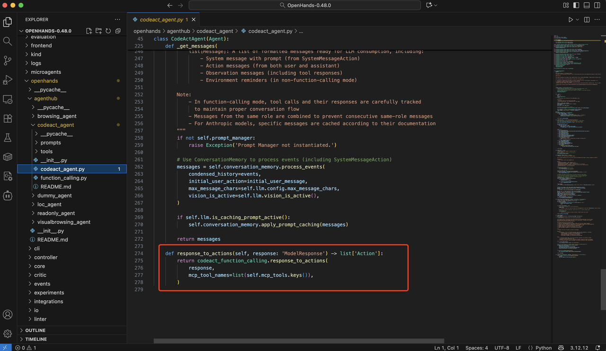

7. 在function_calling.py文件中具体实现了如何从大模型返回的response中解析对应的action
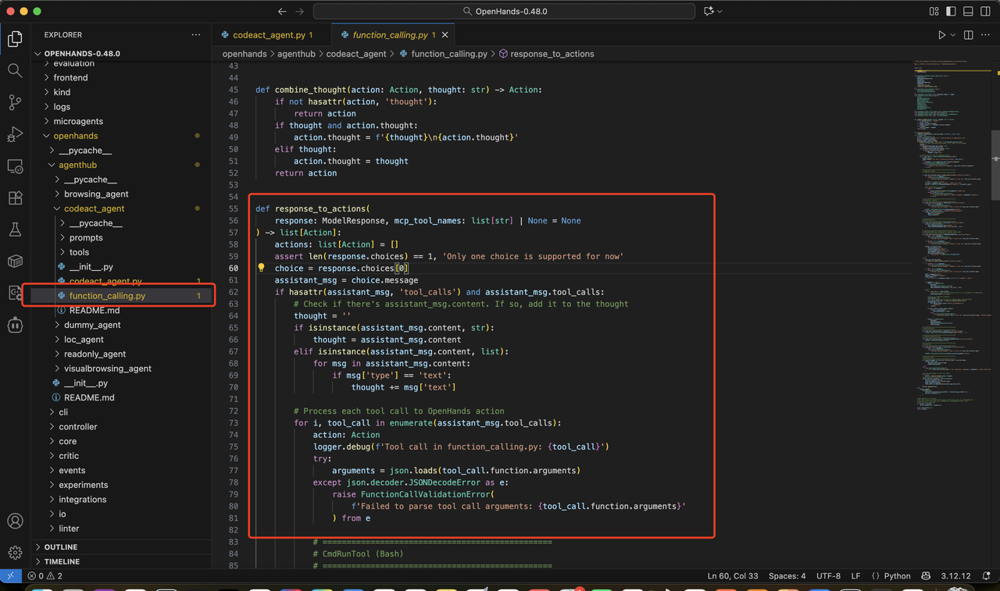
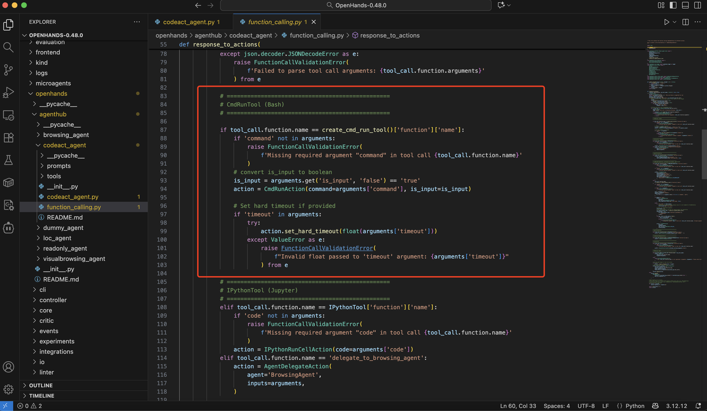

8. 最后通过self.pending_actions.popleft()把解析好的action发送去执行
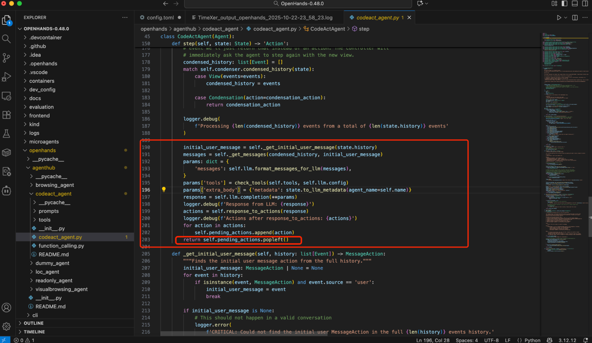
# LLM具体的实现

在openhands/llm/llm.py文件可以看到具体对大模型接口的封装，具体的实现是wrapper方法中可以找到
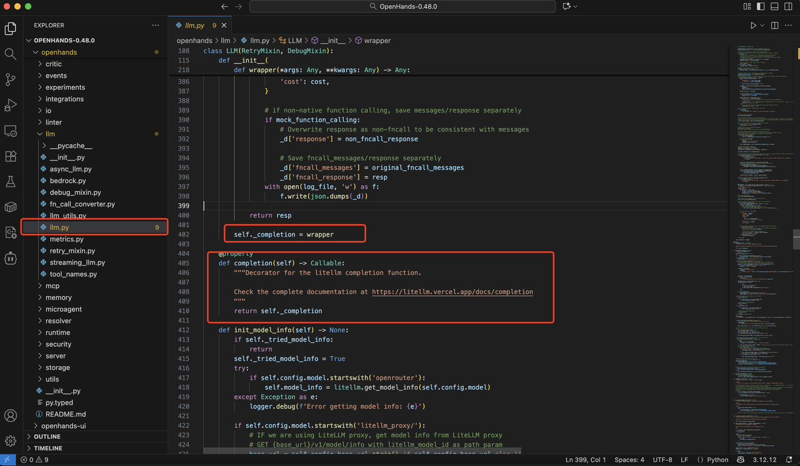
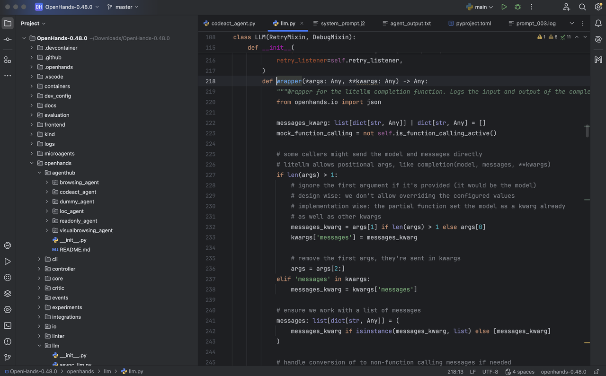
