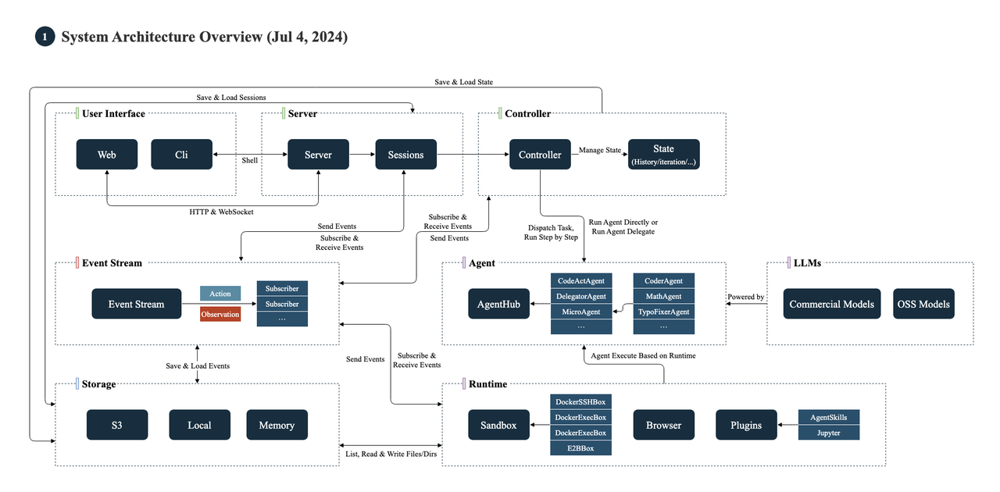
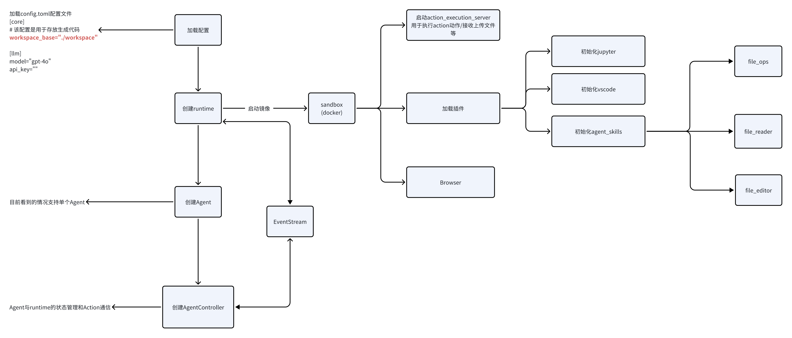
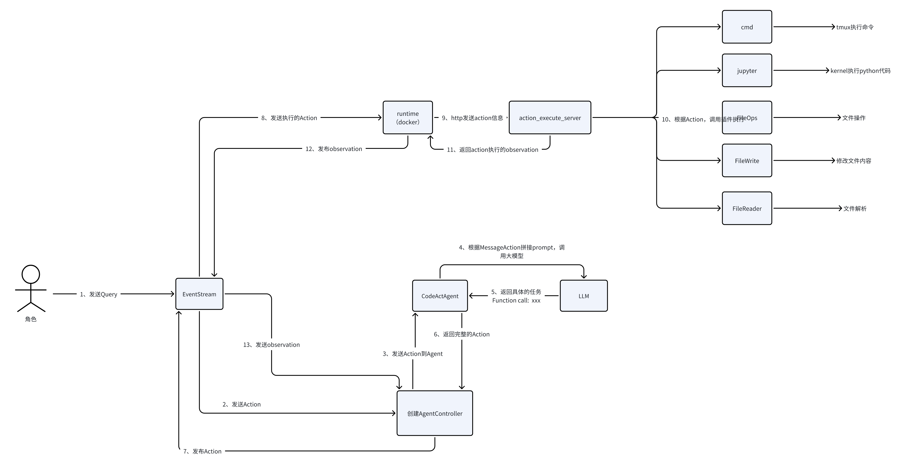

# 整体架构
- 项目地址：https://github.com/All-Hands-AI/OpenHands
- 详细架构：https://docs.all-hands.dev/modules/usage/architecture/backend

主要模块说明：
- Server：用于与客户端链接做session和业务管理
- Controller：管理Agent和Runtime相关的状态，与大模型交互，上下文管理，为Agent派发Action
- AgentHub：用户管理各个agent
- Runtime：提供和管理Action的执行环境
- EventStream：事件中心，用于系统中事件的发布订阅用于Controller和Runtime的状态、执行结果通知

# 启动流程

# 执行流程

# Openhands中CodeActAgent的Tools
- Bash： 在持久shell会话的终端中执行bash命令。
- Ipython：在ipython环境中运行Python代码单元(cell)。
- llm_based_edit：基于LLM编辑文件
- str_replace_edit:  文件相关操作（创建、编辑、查看），提供了字符串替换修改、查看文件行对应内容
- Think: 使用这个工具来思考一些事情。它不会获取新信息或对存储库进行任何更改，而只是记录这个想法在对话历史中。当需要复杂的推理或头脑风暴时使用它。
- WebRead: 从网页上读取（转换为MarkDown标记）内容。
- Browser：使用Python代码与浏览器交互。
- Finish:  表示当前任务或会话完成的信号。
