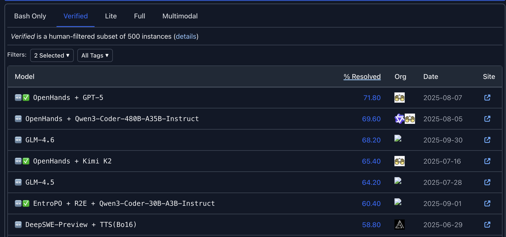
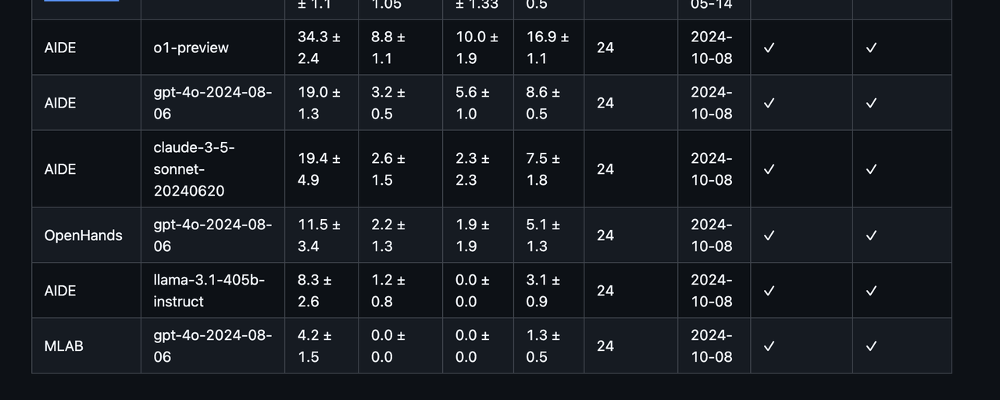

# Module 2 -- Experiment Agent Tutorial
## 阶段一 Openhands Quick Start
### Getting “Hello World” Started
参考以下页面的“openhands环境安装”章节，指引您安装、配置openhands，并自动写一个“Hello World” Python Code。

[Openhands环境安装](Openhands%E7%8E%AF%E5%A2%83%E5%AE%89%E8%A3%85)

### 进阶：主题研究
论文复现（Paper Replication）与适配到新数据集（你关心的场景），被认为是深入理解和批判性评估研究主题的最高级形式，也是学术研究中时间投入巨大的一个环节。我们希望通过openhands，来将复现与适配的工作自动化，在实际任务的Benchmark上自动实验，选出效果最佳的解决方案。

## 阶段二 前置知识学习
### Agent基础知识

建议按照以下提纲进行基础知识学习

| 课程                                  | 学习材料                                                                                                                                                                                                                                                                                                                                                                                                                                                                                                                                                                                                                                                                                                                                                                                                                                                                                                                                                                                                                                                                                                                                                                                                                                                                                                                              | openhands具体实现和调试方法                                                                   |
|-------------------------------------|-----------------------------------------------------------------------------------------------------------------------------------------------------------------------------------------------------------------------------------------------------------------------------------------------------------------------------------------------------------------------------------------------------------------------------------------------------------------------------------------------------------------------------------------------------------------------------------------------------------------------------------------------------------------------------------------------------------------------------------------------------------------------------------------------------------------------------------------------------------------------------------------------------------------------------------------------------------------------------------------------------------------------------------------------------------------------------------------------------------------------------------------------------------------------------------------------------------------------------------------------------------------------------------------------------------------------------------|--------------------------------------------------------------------------------------|
| Project: Building a Simplified Claude Code | [AI Agent科普视频](https://www.youtube.com/watch?v=GE0pFiFJTKo)                                                                                                                                                                                                                                                                                                                                                                                                                                                                                                                                                                                                                                                                                                                                                                                                                                                                                                                                                                                                                                                                                                                                                                                                                                                                       |                                                                                      |
| Prompt Engineering                  | 1. [Prompt engineering 吴恩达](https://www.bilibili.com/video/BV1173jzNELG?spm_id_from=333.788.videopod.episodes&vd_source=939fcefe7496b3f5e80e714aabd2b0c6)  2. [Prompt engineering](https://platform.openai.com/docs/guides/prompt-engineering)  3. [Understanding Role Management in OpenAI’s API: Two Methods Compared](https://community.openai.com/t/understanding-role-management-in-openais-api-two-methods-compared/253289)  4. [The Difference Between System Messages and User Messages in Prompt Engineering](https://medium.com/@dan_43009/the-difference-between-system-messages-and-user-messages-in-prompt-engineering-04eaca38d06e)  5. [前沿LLM的system prompt范例](https://github.com/x1xhlol/system-prompts-and-models-of-ai-tools.git)  6. [Master AI Prompting: Zero-Shot, Few-Shot & Chain of Thought Explained](https://www.youtube.com/watch?v=sZIV7em3JA8)  7. [“Few-Shot Prompting”领域的奠基之作《Language Models are Few-Shot Learners》](https://arxiv.org/abs/2005.14165) 8. [Chain-of-Thought（CoT） Prompting：一种通过在提示中加入推理步骤示例，来激发大型语言模型进行复杂多步推理的技术 讲解视频](https://www.bilibili.com/video/BV1TecTeoErX/?spm_id_from=333.337.search-card.all.click&vd_source=939fcefe7496b3f5e80e714aabd2b0c6) 相关论文： https://arxiv.org/abs/2201.11903   9. [Meta Prompt介绍](meta_prompt/README.md) | [Openhands-prompt调试](Openhands_prompt%E8%B0%83%E8%AF%95/README.md)                   |
| Design Pattern                      | 1. ReAct设计模式  （1）Agent中的ReAct设计模式 核心思想：ReAct 是一种新的范式，旨在使大型语言模型（LLMs）能够通过交错的方式生成**推理轨迹（reasoning traces）和特定于任务的动作（actions）**来解决复杂任务。它结合了链式思考（Chain-of-Thought, CoT）的推理能力和传统动作执行的能力。 工作方式： 模型接收一个问题或任务。 模型生成一个**思考（Thought）**步骤，分析问题并制定下一步计划。 基于思考，模型决定并生成一个动作（Action），这个动作通常是与外部环境（如知识库、API、搜索引擎）进行交互，以获取额外信息或执行某个操作。 模型接收到动作执行后的**观察（Observation）**结果。 模型将观察结果融入其内部状态，并重复“思考 -> 动作 -> 观察”的循环，直到任务完成或达到停止条件。 最后，模型生成最终答案: https://arxiv.org/abs/2210.03629  （2）[CodeAct：ReAct设计模式的一种实现](https://arxiv.org/abs/2402.01030)  （3）[如何构建一个ReAct Agents](https://medium.com/google-cloud/building-react-agents-from-scratch-a-hands-on-guide-using-gemini-ffe4621d90ae)  2. Plan & Exec设计模式                                                                                                                                                                                                                                                                                                                                                                                                                                                                                                                                                                                                                              |                                                                                      |
| Agent、LLM、MCP、A2A、Tools           | 1. [什么是MCP](https://www.youtube.com/watch?v=T-NP5s4vzpo)  2. [什么是A2A](https://www.youtube.com/watch?v=jKCCpplCm2g)  3. [Tool Use-MCP和Function Calling关系与区别](https://www.youtube.com/watch?v=BT5tPe9dcpU)                                                                                                                                                                                                                                                                                                                                                                                                                                                                                                                                                                                                                                                                                                                                                                                                                                                                                                                                                                                                                                                                                                                  | [Openhands-如何与LLM交互](Openhands-%E5%A6%82%E4%BD%95%E4%B8%8ELLM%E4%BA%A4%E4%BA%92/README.md) [Openhands-tools的开发与调试](Openhands-tools%E7%9A%84%E5%BC%80%E5%8F%91%E4%B8%8E%E8%B0%83%E8%AF%95/README.md) |
| Agent Runtime                       | 1. [十分钟入门docker](https://www.youtube.com/watch?v=mPquwpxyUQU)   2. [Making our own code interpreter: making of a sandbox](https://medium.com/@Shrishml/making-our-own-code-interpreter-part-1-making-of-a-sandbox-382da3339eaa)                                                                                                                                                                                                                                                                                                                                                                                                                                                                                                                                                                                                                                                                                                                                                                                                                                                                                                                                                                                                                                                                                               |  |
| Memory                              | 1. 内部context  （1）[Memory in AI agents](https://www.youtube.com/watch?v=UF230UuclZM)   （2）[Memory for agents](https://www.youtube.com/watch?v=JTL0yp85FsE)  （3）[How to Build Self-Learning AI Agents (Python Tutorial)](https://www.youtube.com/watch?v=ynhl8KjjS3Y) 2. 外部RAG （1）[Agentic RAG是什么](https://www.youtube.com/watch?v=0z9_MhcYvcY) （2）[RAG 工作机制详解](https://www.youtube.com/watch?v=WWdlme1EAGI) （3）[使用Python构建RAG系统](https://www.youtube.com/watch?v=D8mqIMeZ4fQ)                                                                                                                                                                                                                                                                                                                                                                                                                                                                                                                                                                                                                                                                                                                                                                                                                          |                                                                                      |
| Self-play & Self-improvement        | 1. Open-Ended Evolution of Self-Improving Agents （1）[Automated design of agentic systems](https://arxiv.org/pdf/2505.22954) （2）[The AI Scientist: Towards Fully Automated Open-Ended Scientific Discovery (Lu et al. 2024)](https://arxiv.org/abs/2408.06292) （3）[AlphaEvolve: A Gemini-powered coding agent for designing advanced algorithms](https://storage.googleapis.com/deepmind-media/DeepMind.com/Blog/alphaevolve-a-gemini-powered-coding-agent-for-designing-advanced-algorithms/AlphaEvolve.pdf) 2. Self improvement with Search & Deep Research Agents （1）[Competition-Level Code Generation with AlphaCode](https://arxiv.org/pdf/2203.07814) （2）[AlphaCode 2 Technical Report](https://storage.googleapis.com/deepmind-media/AlphaCode2/AlphaCode2_Tech_Report.pdf) （3）[Search-o1: Agentic Search-Enhanced Large Reasoning Models](https://arxiv.org/pdf/2501.05366) [以上源自 斯坦福 CS329A Self-Improving AI Agents](https://cs329a.stanford.edu/)                                                                                                                                                                                                                                                                                                                                      |                                                                                      |

### 典型Coding Agent -- Openhands解构 （Optional）
建议EA开源项目参与者必选，其他研究内容参与者可选
[Openhands解构](Openhands解构/README.md)

## 阶段三 参与科研工作
### 1. LLM能力边界探索 ：以数据驱动任务为例
#### 研究背景
目前使用LLM来进行计算机学科研究任务乃至自然科学研究任务是一大热门领域，现有的一些工作例如AlphaEvolve通过实验，验证了LLM在个别领域和任务上已经达到甚至超过了人类的顶尖水平。然而现有方法在前沿的有挑战性的任务上泛化能力较差，LLM往往倾向使用简单平庸的代码完成任务，与人类在该任务上最新的算法模型差距很大。因此，对当前LLM在数据驱动任务上的能力边界进行测评，对其平庸解的产生机理的分析有重要价值，有助于将黑盒子打开，为未来的研究技术发展提供洞察。

#### 技术挑战
- 闭源 SOTA 的设置对齐：AlphaEvolve 未开源，使用open-evolve 项目尽可能对齐效果，并报告实现差异带来的不确定性。
- 平庸解判定的标准化：仅看分数不足以识别“平庸”，需要人工基于统一指标分析生成的代码，并进一步解释和追溯平庸输出。

#### 技术需求
- 开源项目复现的动手能力：需要能复现并理解开源代码仓库open-evolve，并使用该项目完成指定的数据驱动任务。
- 对 LLM 生成代码算法的分析能力：需要能理解并分析LLM为了完成任务所生成的算法与模型，能辨别LLM生成的代码结构与该任务上人类的SOTA工作的差异。

#### 研究内容
针对LLM完成数据驱动任务的能力和边界进行定量定性的分析与实验，目标是剖析与暴露当前LLM只能输出"平庸解"的问题及其成因。目标是评估与测试当前最新的闭源与开源模型，在前沿的数据驱动任务上的能力与表现，并分析完成任务所采用的方案。主要工作内容包括：
- 使用open evolve进行实验，测试3种模型（GPT-5, Claude-4.5, DeepSeek-V3.1）在Wind Power任务上的能力与表现，并分析输出方案的特征。
- 通过询问模型指定的SOTA论文相关的内容，判断模型是否已经具有SOTA工作的知识。探究Wind Power任务的3个SOTA工作，设计3个与SOTA论文内容有关的问题进行提问，判断该工作是否包含在（gpt-3.5、gpt-4o、gpt-5）中。

#### 学生要求及产出
- 要求：基本具备论文阅读和开源项目复现能力，英语过关（能快速理解log）
- 时间：1-2月
- 产出：顶会/刊论文，成为论文共同作者

### 2. Experiment Agent开发与开源
#### 研究背景
在数据驱动研究中，真正的挑战不是算法太多，而是如何高效理解与验证它们。每个研究项目都需从成千上万的论文与开源代码中寻找最优方案（SOTA），理解逻辑、适配基准、调试评测——这一过程漫长而重复。
Experiment Agent 的使命，就是让这一切自动化。借助大型语言模型（LLM）的智能协作，它能完成论文解析、代码理解、算法适配与超参数调优，像一位不知疲倦的科研伙伴，高速评估海量模型并持续寻优。
与传统代码助手只追求“代码能跑”不同，Experiment Agent 追求的是“算法更强”——它让实验从人工执行转向智能探索，加速科研从想法到验证的全流程。
如今已有优秀的 Coding Agent（如 OpenHands[1]、SWE-Agent[2]、Trae-Agent[3]等）在通用编程任务上表现卓越。
以 OpenHands 为例：
- GitHub ⭐️ 64.7K、贡献者 419人；
- 2024年9月获 500万美元融资；
- 在 SWE-bench-Verified（通用编程任务）排名第一。
但在 MLE-bench（数据驱动研究任务）中，它的表现却跌至倒数第三。
这正揭示了关键差距：当前 Agent 擅长编程，却不擅长科研。
Experiment Agent 的目标是弥合这一代差——以 自动化复现 + 批量对比 + 系统化调优，把原本需要数周的人力流程压缩至数小时。我们要打造的，是一个真正能自主理解论文、适配代码、优化算法性能的开源智能实验平台，让科研从人工实验走向智能探索。

图1（SWE-bench-Verified 榜单）

图2（MLE-bench 榜单）

#### 技术挑战
- 环境异构性：不同论文的代码环境差异大、依赖复杂且难以复现
- 隐性知识发现：复现对应SOTA工作的实验通常需要隐含的特定领域知识，而这些知识在原始论文或代码仓库中并未明确记录
- 性能适配：Agent成后适配的代码常常无法自动找到最佳配置，导致算法在新 benchmark 上性能受限

#### 技术需求
- SOTA相关论文收集、筛选和相关的代码理解：围绕SOTA论文和SOW自动挑选最相关的 k 篇参考文献论文与开源仓库，自动抽取模型结构、关键假设与依赖关系，生成适配计划，形成“〈摘要，代码〉对”作为隐性领域知识与常用的代码实现套路。
- 自动化准备SOTA工作运行环境并复现：根据SOTA的github项目，自动下载数据集、安装代码运行环境并复现sota论文中的评测信息，形成具体的dockerfile
- 超参数调优与批量评估：在统一环境下进行可观测、可复现的调参与横向对比。
- 结果汇总与选优：输出排行榜、最优配置与可复现脚本，作为后续改造的基线。

#### 学生要求及产出
- 要求：掌握大模型驱动的智能体开发技术栈，熟悉python
- 时间：1-2月
- 产出：Experiment Agent开源项目，作为开源项目核心贡献者

#### 参考文献
**[1]** Wang, X., Li, B., Song, Y., Xu, F. F., Tang, X., Zhuge, M., ... & Neubig, G. (2024). Openhands: An open platform for ai software developers as generalist agents. arXiv preprint arXiv:2407.16741.  
**[2]** Yang, J., Jimenez, C. E., Wettig, A., Lieret, K., Yao, S., Narasimhan, K., & Press, O. (2024). Swe-agent: Agent-computer interfaces enable automated software engineering. Advances in Neural Information Processing Systems, 37, 50528-50652.  
**[3]** Gao, P., Tian, Z., Meng, X., Wang, X., Hu, R., Xiao, Y., ... & Trae Research Team. (2025). Trae agent: An llm-based agent for software engineering with test-time scaling. arXiv preprint arXiv:2507.23370.

### 3. RA典型应用：融合电子病历文本与结构化数据的医学预测模型研究
#### 研究内容
近年来，以《Nature》、《Science》为代表的顶级期刊涌现了大量利用人工智能进行疾病预测和健康管理的研究。这些前沿工作的一个显著趋势是，从单一数据源转向多模态数据融合，以求更全面、精准地刻画复杂的生命健康状态。然而，当前多数模型在融合临床两大核心数据——即蕴含丰富上下文信息的非结构化文本（如电子病历、医嘱笔记）与包含标准化指标的结构化表格（如检验检查结果）——方面仍面临挑战，数据的深层价值远未被充分挖掘。本课题旨在直面这一挑战，通过构建先进的深度融合模型，最大化地利用现有数据资产的协同价值。

##### 阶段一：现有SOTA基线评估
目标是评估当前领域内最先进（SOTA）模型在公开医学基准数据集上的表现、价值与局限性。主要工作内容包括：
1. 运用Deep Research工具，系统性调研并定位NCS等顶刊中健康预测的相关工作及其Benchmark。
2. 重点复现并评估这些SOTA模型的数据处理、特征提取及模态融合机制。

##### 阶段二：呼吸道感染个体化预测模型构建
目标是基于阶段一找到的SOTA工作的模型，构建一个用于呼吸道感染诊断、病原体识别及预后预测的多模态模型。主要工作内容包括：
1. 基于前沿的注意力机制、图神经网络或Transformer架构，探索新颖的文本-表格数据深度融合策略，以实现两种模态信息的有效对齐与互补增强。
2. 利用Coding Agent高效完成模型的数据准备、代码实现、模型训练与超参数优化。
3. 在公开数据集和实际临床数据上进行严格的性能验证，并与SOTA基线进行全方位比较。

#### 学生要求及产出
- 学生要求：
  1. 能熟练运用大语言模型（LLM）进行高效的信息检索、归纳与分析。
  2. 对Deep Research及Coding Agent（如TRAE、Cursor）的应用有一定了解。
  3. 具备Python编程基础，能够阅读并初步判断Coding Agent所生成代码的逻辑正确性。
- 产出：顶会/刊论文，成为论文共同作者
- 时间：2-4月
