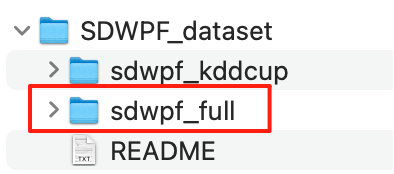

## 1 任务介绍

**风电功率可靠预测是****新能源****大规模有序****并网****的关键。**风力发电对天气依赖较强，具有间歇性和波动性特征，因此发电电量较难预测，大规模集中并网会对电网的稳定运行产生较大的冲击。因此风力发电的准确预测可帮助电网调度部门提前做好传统电力与风电的调控计划，改善电力系统调峰能力，增加风电并网容量。

**风电功率预测精度直接影响到电站的运营与盈利。**功率预测相关政策趋于严格，“双细则”明确和加强考核罚款机制。

风电功率预测分为超短期、短期、中长期。其中，**超短期和短期预测均用于电网调度。**

根据各能源局《发电厂并网运行管理实施细则》：

1） 电站必须于每天早上 9 点前向电网调度部门报送短期功率预测数据，用于电网调度做未来1天或数天的发电计划；

2）每 15 分钟向电网调度部门报送超短期功率预测数据，用于电网调度做不同电能发电量的实时调控。



另外，2025年2月发布的《136号文》明确要推动新能源公平参与实时市场，加快实现自愿参与日前市场。实时市场、日前市场分别对应超短期预测、短期预测。

**本次任务聚焦在****短期（日前）****风电功率预测。**

## 2 任务目标

利用历史数据，对**未来****48****小时内**的风电场功率输出进行预测，预测时间间隔为每 **10 分钟**一次，因此每台风机需要输出长度为 **144**个时间步的功率时间序列，即每台风机次日0时到24时每 10 分钟共 144 个时间节点的功率预测。

目前绝大多数用于科研/竞赛的数据集采样频率与我国报送数据分辨率不一致：

（1）该数据集竞赛的原任务是预测每台风机未来48小时每 10 分钟共 288 个时间节点的功率；

（2）我国实际日前预测任务是每台风机次日0时到24时每 15 分钟共 96 个时间节点的功率预测。

（3）考虑到数据采样频率不一致，模型的预测性能可能受到“10 → 15 min 降采样，对齐数据分辨率”引入的信息损失影响，本任务遵循原数据采样频率，为10分钟。

（4）数据采样频率差异详情，可查看[3]

## 3 数据

数据下载地址：https://figshare.com/articles/dataset/SDWPF_dataset/24798654

**使用最新版本的数据，即****sdwpf_full****目录下的数据，是在旧版****SCADA****检测数据下，扩增时间范围 + NWP数据**；

sdwpf_kddcup目录下是KDD Cup发布时的旧版数据。


- 新版数据相对旧版数据的扩充：

| 项目     | 旧版（KDD Cup 发布时）         | 新版 SDWPF (2024 Figshare v1)     |
| -------- | ------------------------------ | --------------------------------- |
| 时间跨度 | 2020-01 – 2020-08（约 245 天） | 2020-01 – 2021-12（整整 24 个月） |
| 采样频率 | 10 min                         | 10 min（不变）                    |
| 风机数量 | 134                            | 134                               |
| 记录条数 | ≈ 4.7 百万                     | 11 361 191 条（≈ 11.4 百万）      |
| 特征列   | 14 列                          | 19 列（新增 5 列气象特征）        |

- sdwpf_2001_2112_full.csv 详细的字段介绍，参考https://zhoujingbo.github.io/paper/2024SDWPFScientificData.pdf

| 列名    | 单位 | 关键说明                                                     |
| ------- | ---- | ------------------------------------------------------------ |
| TurbID  | -    | 风机唯一标识符，区分不同风机                                 |
| Tmstamp | -    | 数据采集时间戳，采集/清洗阶段会删去部分 10 min 记录，因此相邻时间戳可能出现 20 min、30 min 或更长跳跃 |
| Wspd    | m/s  | 实测风速（风机轮毂高度处）                                   |
| Wdir    | °    | 相对风向角（风–机舱），Wdir = 绝对风向 - Ndir                |
| Etmp    | °C   | 环境温度（风机外部大气温度）                                 |
| Itmp    | °C   | 风机内部温度（通常指机舱温度）                               |
| Ndir    | °    | 机舱朝向（风机旋转角度）                                     |
| Pab1    | °    | 叶片1的桨距角（控制叶片受风角度）                            |
| Pab2    | °    | 叶片2的桨距角                                                |
| Pab3    | °    | 叶片3的桨距角                                                |
| Prtv    | kW   | 无功功率（用于建立电磁场，不做功）                           |
| T2m     | °C   | 2米高度处气温 from ERA5                                      |
| Sp      | Pa   | 地表气压 from ERA5                                           |
| RelH    | %    | 相对湿度（空气含水饱和度百分比）                             |
| Wspd_w  | m/s  | 10米风速 from ERA5                                           |
| Wdir_w  | °    | 10米风向 from ERA5                                           |
| Tp      | m    | 总降水量 from ERA5                                           |
| Patv    | kW   | 实际有功功率（预测目标）                                     |

ERA5 是由 **欧洲中期天气预报中心（ECMWF）** 为欧洲哥白尼气候变化服务（C3S）生产的 **第五代全球再分析数据集，为风机** **SCADA** **数据提供了 大尺度、连续且质量控制良好的气象特征。**

- sdwpf_turb_location_elevation.csv详细字段：

| 列名          | 单位 | 含义                                                         |
| ------------- | ---- | ------------------------------------------------------------ |
| **TurbID**    | —    | 风机编号（1 – 134）                                          |
| **x**         | m    | 风机在风场坐标系中的 **东向（x）相对坐标**，原点取自运维方定义，量纲为米，可直接用于计算风机间欧氏距离 |
| **y**         | m    | 风机在风场坐标系中的 **北向（y）相对坐标**，量纲为米         |
| **Elevation** | m    | **风机平台处相对海拔**（Above Sea Level），有助于后续研究中考虑空气密度、尾流受地形遮挡等效应，提高复杂地形下的功率预测精度 |

## 4 评价指标

下面给出严格的数学符号，把“134 台风机 × 142 个测试切片”的完整评估逻辑一步步写成公式。

记

| 记号              | 含义                                                         |
| ----------------- | ------------------------------------------------------------ |
| $$S=142$$         | 测试切片（sample）总数，每个切片覆盖 24 h（N=144个 10 min 时间步） |
| $$T=13$$          | 风机数量                                                     |
| $$N=144$$         | 一个切片中的时间步数                                         |
| $$y_{s,t,i$$      | 第 s个切片、风机 t、时间步 $$$$ 的 真实功率（已由 kW ➜ MW）  |
| $$\hat y_{s,t,i$$ | 相同位置的 **预测功率**                                      |

> **所有功率先除以 1000 变为** **MW****，然后再算误差** 

1 ）单风机、单切片指标

$$\text{MAE}_{s,t}\;=\;\frac1N \sum_{i=1}^{N}\left|\,\hat y_{s,t,i}-y_{s,t,i}\,\right| \qquad\qquad \text{RMSE}_{s,t}\;=\;\sqrt{\frac1N \sum_{i=1}^{N}\bigl(\hat y_{s,t,i}-y_{s,t,i}\bigr)^{2}}$$

单个数据切片内，对于单风机，计算每个时间步的误差，然后求和，取时间步的平均值。

2 ） 单切片汇总（134 台求和）

$$\text{MAE}^{(s)}_{\text{tot}} =\sum_{t=1}^{T}\text{MAE}_{s,t}, \qquad \text{RMSE}^{(s)}_{\text{tot}} =\sum_{t=1}^{T}\text{RMSE}_{s,t}$$

单个数据切片内，把所有风机的误差加起来。

3 ） 跨 142 个切片取平均

$$\overline{\text{MAE}} =\frac1S\sum_{s=1}^{S}\text{MAE}^{(s)}_{\text{tot}}, \qquad \overline{\text{RMSE}} =\frac1S\sum_{s=1}^{S}\text{RMSE}^{(s)}_{\text{tot}}$$

跨142个数据切片，相加取平均。

4 ）最终比赛得分

$$\boxed{\; \text{Score} =\frac{\overline{\text{MAE}}+\;\overline{\text{RMSE}}}{2} \;}$$

伪代码如下：

```Python
for i in range(142):  # 142个切片
    # 1. 预测与真实值
    prediction = 预测结果[134台风机, 144步]
    gt_ys = 真实值[134台风机, 144步]
    gt_turbines = 真实DataFrame[134台风机]
    
    # 2. 汇总风机指标
    all_latest_mae, all_latest_rmse = [], [], [], []
    for j in range(134):  # 134台风机
        # 2.1 过滤异常点
        # 2.2 计算最近一天（144步）的MAE、RMSE
        latest_mae, latest_rmse = turbine_scores(prediction[j], gt_ys[j], gt_turbines[j], 144)
        all_latest_mae.append(latest_mae)
        all_latest_rmse.append(latest_rmse)
    # 2.3 汇总所有风机
    total_latest_mae = sum(all_latest_mae)
    total_latest_rmse = sum(all_latest_rmse)
    
    # 4. 记录本次切片的指标
    maes.append(total_latest_mae)
    rmses.append(total_latest_rmse)

# 5. 统计142次的平均指标
avg_mae = mean(maes)
avg_rmse = mean(rmses)

total_score = (avg_mae + avg_rmse) / 2
```

 [evaluation.zip](evaluation.zip) 

官方（竞赛）提供的评测运行代码demo链接，可参考:

https://github.com/PaddlePaddle/PaddleSpatial/tree/main/apps/wpf_baseline_gru/kddcup22-sdwpf-evaluation

## 5 相关工作

- TimeXer：https://github.com/thuml/TimeXer
- ST-ReP: Learning Predictive Representations Effciently for Spatial-Temporal Forecasting
  - 在KDD CUP 2022比赛数据集上的MAE只有0.225，远超比赛榜单第一
  - github地址：https://github.com/zhuoshu/ST-ReP
- Unified Training of Universal Time Series Forecasting Transformers
  - 这是赛后发的论文，从论文实验结果来看超过了比赛榜单第一的工作，MAE0.38
  - github地址：https://github.com/SalesforceAIResearch/uni2ts
- 2DXformer: Dual Transformers for Wind Power Forecasting with Dual Exogenous Variables
  - 在数据集上的mae 为0.42
  - Github地址:https://github.com/jseaj/2DXformer
- EXPAND AND COMPRESS: EXPLORING TUNING PRIN - CIPLES FOR CONTINUAL SPATIO-TEMPORAL GRAPH FORECASTING
  - ICLR2025
  - github:https://github.com/Onedean/EAC
- Large Time Series Model
  - 时序大模型方法
  - github地址：https://github.com/thuml/Large-Time-Series-Model
- Time-MoE: Billion-Scale Time Series Foundation Models with Mixture of Experts
  - 大模型的方法
  - github地址：https://github.com/Time-MoE/Time-MoE
- Hiformer: Hybrid Frequency Feature Enhancement Inverted Transformer for Long-Term Wind Power Prediction"
  - paper_download_link: "https://arxiv.org/pdf/2410.13303.pdf"
  - research_problem_and_motivation: "该论文聚焦于**长时间跨度**的风电功率预测任务。作者指出，以往许多研究偏重于短期预测，往往忽视了长周期预测对电网调度和能源市场的重要性。实际上，为了制定发电计划和进行电力交易，电网需要对未来数十小时至数天的风电出力做出精确预估。然而由于风速风向等气象因素的随机性，长时序预测面临更大的不确定性和挑战，直接采用短期模型会导致精度下降并增加计算成本。因此，本研究的动机是在考虑天气因素影响的前提下，提出一种适用于长时间序列的风电预测模型，以显著提高长时段风电功率预测的准确性并降低推理计算开销，从而支持大规模风能更可靠地并网利用。"
  - contributions_and_innovations: "本文的主要贡献是设计了一个专门用于长序列风电预测的Transformer架构——**Hiformer**，在特征处理和模型结构上均有创新：(1) 提出了一种**混合频率特征增强**机制，将时间序列的信号分解与气象特征提取相结合，增强了模型对不同时间尺度下风电变化模式的表征能力。通过引入频域分解方法，模型能够分别捕捉风电功率的低频长期趋势和高频短期波动，并结合关键气象变量（如风速、风向等）来刻画环境因素对功率的影响；(2) 采用了改进的**Inverted Transformer**编码器架构，仅使用Transformer编码器堆叠而省略了解码器，通过多尺度的时序下采样和特征融合来实现长序列建模。该架构使用分层的编码器对时间序列进行粗细粒度交替的表示学习，并在编码过程中引入跳跃连接确保长程预测的稳定性；(3) 在性能上，Hiformer显著超越了先前的最佳模型。根据论文给出的结果，相较之前的SOTA方法，本模型将预测精度最高提升了约52.5%，同时将计算时间最多减少了约68.5%，在长时间风电功率预测任务上达到了新的性能峰值。"
  - methodology_or_algorithm: "Hiformer的方法是将时序分解、气象信息融合与Transformer编码器有机结合。首先，作者对原始风电功率序列进行信号分解处理，将历史功率数据拆解为不同频率成分（例如趋势部分和周期波动部分），以分别提取长短期特征。同时，将对应时间的历史气象观测作为附加特征输入。模型采用改进的**Transformer编码器**框架，在每一层分别处理时间序列特征和气象特征，然后通过**混合频率特征增强模块**(Hybrid Frequency Feature Enhancement)将两类特征融合，捕捉气象条件与功率变化之间的相关关系。编码器内部引入了**分层多尺度**结构：对时间序列逐步降采样获取粗粒度表示，再通过上采样和残差连接逐层恢复细粒度信息，从而在长序列预测中既抓住全局趋势又保留局部细节。最终，Hiformer利用一个前馈网络将最后一层编码器输出直接映射为未来预定时长（例如48小时，包含若干步）的功率预测值，不需要传统Transformer的解码器部分。由于采用仅编码器的设计并结合多尺度特征融合，该算法在保证预测精度的同时有效降低了长序列预测的模型复杂度和运行时间。"
  - "evaluation_results": { "Spatial Dynamic Wind Power Forecasting (SDWPF) dataset": { "MAE": 0.27, "MSE": 0.19 } },
  - "github_url": "https://github.com/valuestdio/Hiformer"

## 6 其他参考材料

[1]风电功率预测-调研原始材料：[新能源功率预测](https://dcn102rh88o5.feishu.cn/wiki/IU3vwqSWKi6ejfkcRSAcXfmInPh)

[2]风电物理模型 & 功率预测技术路线调研：[风电功率预测](https://dcn102rh88o5.feishu.cn/wiki/J4F4wsn3LidAhckEH8ycXdSGnPe)

[3] SDWPF数据集的10分钟分辨率与国内电网15分钟报送粒度比较.pdf
