# 第一章：解码寒武纪（688256.SH）的收益与风险

本章，我们将正式进入量化交易的实战阶段。

作为一名量化研究员，当面对一只股票时，我们不会先听消息、看论坛或者猜测未来，而是先做一件事：

> **获取数据。**

因为所有的收益、风险、趋势和规律，都隐藏在历史数据之中。

本章，我们将以中国 AI 芯片代表企业——**寒武纪（688256.SH）** 为研究对象，使用 Python 编程语言与 AI 协同工具（Cline），亲手分析其自上市以来的真实交易数据。

---

# 任务一：获取寒武纪历史数据

在量化交易领域，有一句非常经典的话：

> Garbage In, Garbage Out.
>
> （垃圾数据产生垃圾结果。）

因此，任何研究开始之前，第一件事都是获得可靠的数据。

在 A 股市场中，很多交易软件（例如通达信）都会维护自己的行情数据库。

而 Python 社区已经有人把这些数据接口封装成了现成的库。

本课程将使用：```mootdx``` 来获取真实的 A 股历史行情数据。 https://github.com/mootdx/mootdx

---

## 步骤1：安装 mootdx

请向 Cline 提出以下需求：

```text
请帮我安装 mootdx。

要求：
1. 创建独立Python虚拟环境
2. 安装 mootdx
3. 验证安装成功

完成后，确认以下代码能够正常运行：

import mootdx
print(mootdx.__version__)
```

后面Cline 就会根据我们的要求帮我们安装Python，创建虚拟环境，然后安装mootdx

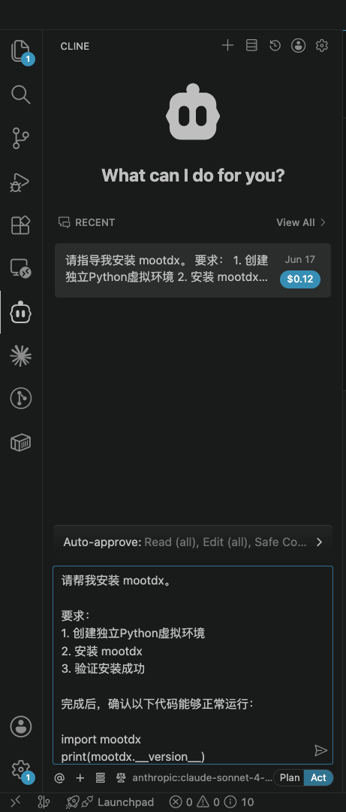
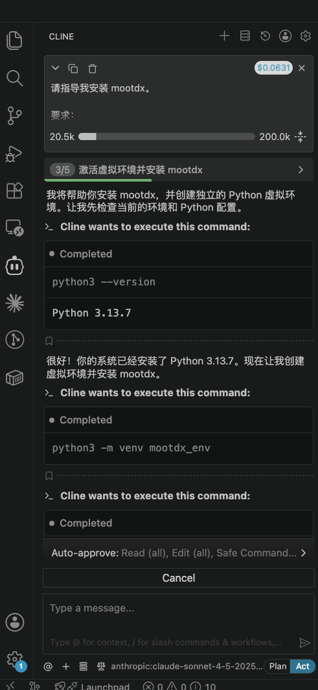
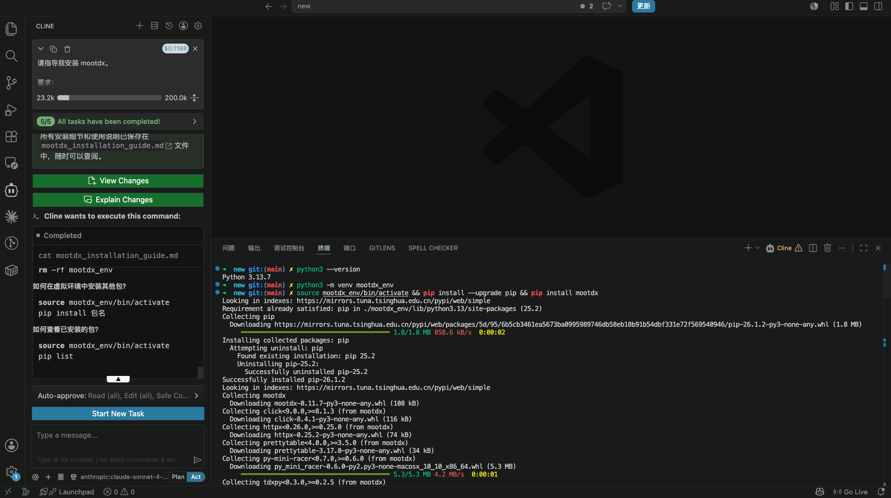

为了方便查看文件和代码，我们可以用鼠标点击Cline 图标把对话框移到右边
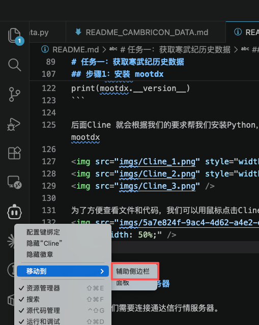

---

## 步骤2：连接行情服务器

接下来，我们需要连接通达信行情服务器。

请向 Cline 提出：

```text
使用 mootdx 编写示例程序：

1. 自动选择可用行情服务器
2. 建立连接
3. 输出服务器信息
4. 添加异常处理
5. 代码添加详细注释
```

Cline会帮我们写脚本，运行程序，确认连接成功。
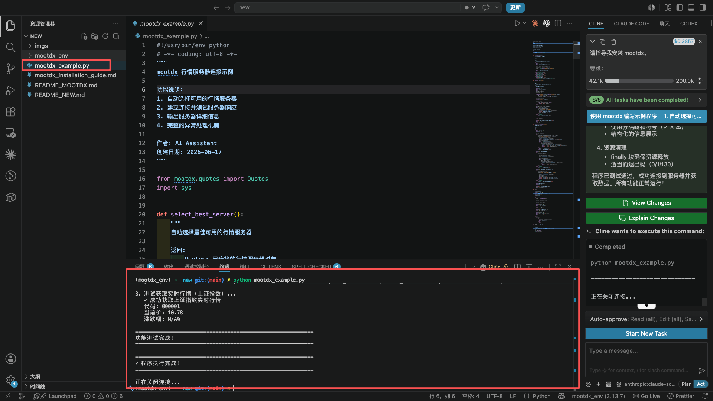

---

## 步骤3：获取寒武纪日线数据

寒武纪股票代码：```688256```
市场：```上海证券交易所```

请向 Cline 提出：

```text
使用 mootdx 获取寒武纪（688256）的历史日线数据。

数据范围：
2020-07-20 到2025-12-31

要求：
1. 获取全部可获取历史数据
2. 返回 pandas DataFrame
3. 输出前10行
4. 输出后10行
5. 输出数据总行数
6. 保存为 CSV 文件
7. 代码中添加完整注释
```

等待一会，我们需要的寒武纪2020-2025年的数据就全部下载好了。

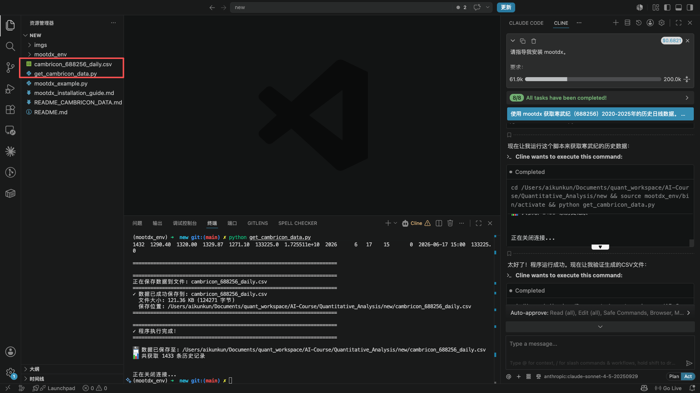

在Cline干活的过程中可以了解一下它在完成数据下载的过程中都做了什么。以及最终的代码都做了哪些事，这些在代码中都有详细的注释，详细解释了每一步都完成了什么动作。

> 程序的主入口一般是`main()`

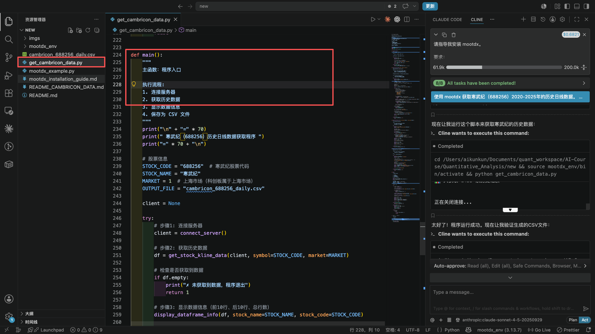


#### 运行结果：
```markdown
======================================================================
 寒武纪（688256）历史日线数据获取程序
======================================================================

======================================================================
正在连接行情服务器...
======================================================================
✓ 成功连接到行情服务器！

----------------------------------------------------------------------
正在获取股票 688256 的历史日线数据...
----------------------------------------------------------------------
开始获取数据（每次获取 800 条记录）...
  第 1 批: 获取到 800 条记录
  第 2 批: 获取到 633 条记录
  数据获取完成（本批次 633 条 < 800）

✓ 数据获取成功！共获取 1433 条记录
----------------------------------------------------------------------

======================================================================
 寒武纪（688256）历史数据统计
======================================================================

📊 数据总行数: 1433 条记录

📋 数据列名:
  1. open
  2. close
  3. high
  4. low
  5. vol
  6. amount
  7. year
  8. month
  9. day
  10. hour
  11. minute
  12. datetime
  13. volume

📅 数据时间范围: 2020-07-20 15:00 至 2026-06-17 15:00

----------------------------------------------------------------------
📈 前 10 行数据:
----------------------------------------------------------------------
     open   close    high     low       vol        amount  year  month  day  hour  minute          datetime    volume
0  250.00  212.40  295.00  205.60  242376.0  5.645862e+09  2020      7   20    15       0  2020-07-20 15:00  242376.0
1  208.00  274.00  285.60  202.00  175848.0  4.292971e+09  2020      7   21    15       0  2020-07-21 15:00  175848.0
2  260.00  281.00  284.33  257.77  127018.0  3.450335e+09  2020      7   22    15       0  2020-07-22 15:00  127018.0
3  274.92  281.50  297.77  268.00   99202.0  2.791442e+09  2020      7   23    15       0  2020-07-23 15:00   99202.0
4  273.00  259.33  276.00  240.44  113852.0  2.940729e+09  2020      7   24    15       0  2020-07-24 15:00  113852.0
5  252.28  234.01  257.90  227.94   83388.0  2.022044e+09  2020      7   27    15       0  2020-07-27 15:00   83388.0
6  236.00  238.64  243.80  227.50   59775.0  1.410915e+09  2020      7   28    15       0  2020-07-28 15:00   59775.0
7  234.53  241.50  245.78  229.66   54732.0  1.312286e+09  2020      7   29    15       0  2020-07-29 15:00   54732.0
8  240.00  243.17  254.99  236.36   61808.0  1.516838e+09  2020      7   30    15       0  2020-07-30 15:00   61808.0
9  238.01  249.60  255.55  237.10   56294.0  1.392176e+09  2020      7   31    15       0  2020-07-31 15:00   56294.0

----------------------------------------------------------------------
📉 后 10 行数据:
----------------------------------------------------------------------
         open    close     high      low       vol        amount  year  month  day  hour  minute          datetime    volume
1423  1365.00  1358.90  1400.00  1347.00   88415.0  1.212111e+10  2026      6    4    15       0  2026-06-04 15:00   88415.0
1424  1342.00  1299.20  1407.77  1287.34  116354.0  1.562060e+10  2026      6    5    15       0  2026-06-05 15:00  116354.0
1425  1239.30  1250.36  1298.88  1230.08  114170.0  1.437635e+10  2026      6    8    15       0  2026-06-08 15:00  114170.0
1426  1279.00  1270.01  1285.80  1239.02  106731.0  1.351413e+10  2026      6    9    15       0  2026-06-09 15:00  106731.0
1427  1300.00  1231.00  1349.90  1224.17  138327.0  1.777183e+10  2026      6   10    15       0  2026-06-10 15:00  138327.0
1428  1221.96  1219.50  1255.00  1199.00  111819.0  1.363200e+10  2026      6   11    15       0  2026-06-11 15:00  111819.0
1429  1258.00  1240.00  1260.00  1202.00  149765.0  1.837626e+10  2026      6   12    15       0  2026-06-12 15:00  149765.0
1430  1253.00  1335.00  1345.99  1238.88  154373.0  2.020454e+10  2026      6   15    15       0  2026-06-15 15:00  154373.0
1431  1335.50  1306.99  1335.91  1297.79   99671.0  1.309623e+10  2026      6   16    15       0  2026-06-16 15:00   99671.0
1432  1290.40  1320.00  1329.87  1271.10  133225.0  1.725511e+10  2026      6   17    15       0  2026-06-17 15:00  133225.0

======================================================================

======================================================================
正在保存数据到文件: cambricon_688256_daily.csv
======================================================================
✓ 数据已成功保存到: cambricon_688256_daily.csv
  文件大小: 121.36 KB (124271 字节)
  保存位置: /Users/xxxx/Documents/quant_workspace/AI-Course/Quantitative_Analysis/new/cambricon_688256_daily.csv
======================================================================

======================================================================
✓ 程序执行完成！
======================================================================

💾 数据已保存至: /Users/xxxx/Documents/quant_workspace/AI-Course/Quantitative_Analysis/new/cambricon_688256_daily.csv
📊 共获取 1433 条历史记录


正在关闭连接...
```


我们可以打开csv，查看下载的数据是否正确
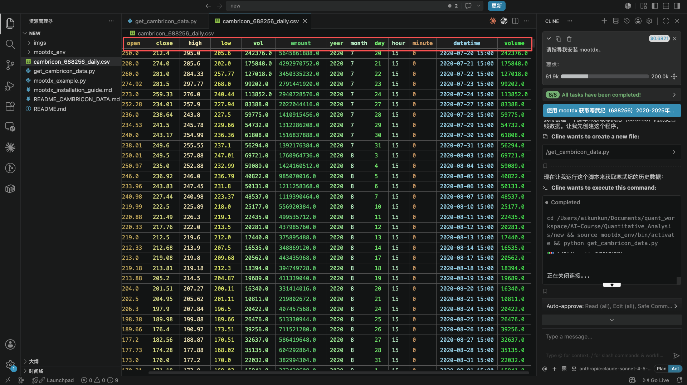

---


## 任务二：看看股价是怎么变化的

数字表格并不直观。

接下来，我们把数据画成图。

### 操作步骤

向 Cline 输入：

```text
读取寒武纪历史数据，

绘制收盘价走势图。

要求：

1. 横轴为日期
2. 纵轴为收盘价
3. 显示完整历史走势
```

画图过程中需要下载 Python画图需要的库，我们耐心等待即可
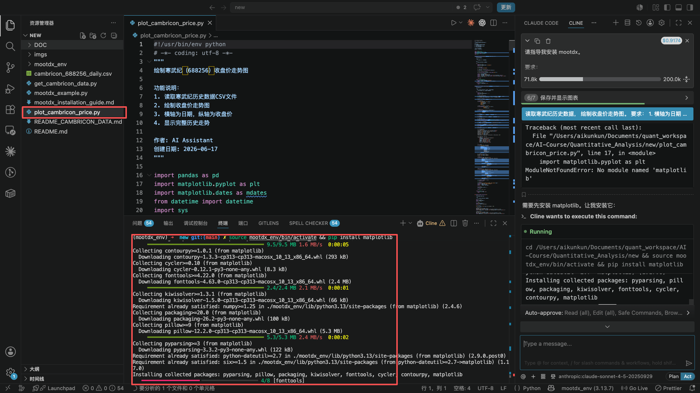

经过一段时间的等待，Cline就帮我们创建了Python程序，并通过刚才下载的数据生成了下面的折线图。

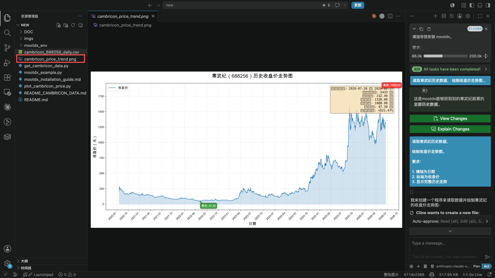

这里生成的图表可能会出现中文显示问题，也可以尝试使用下面的指令让Cline修复

```
生成的图片中文显示是乱码，帮我修复
```
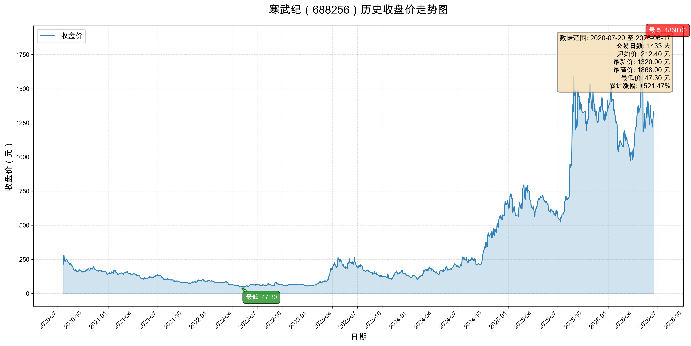

---

### 观察与思考

看到图之后，请思考：

#### 问题1

寒武纪的走势是平稳上涨的吗？
还是经历了剧烈波动？

---

#### 问题2

如果你在最高点买入，之后股价腰斩，你还能继续持有吗？

---

#### 问题3

如果你在最低点附近买入，后来上涨数倍，你会不会提前卖掉？

---

## 任务三：寻找最疯狂的交易日

走势图只能看到整体趋势。

接下来，我们看看哪些交易日最特殊。

### 操作步骤

向 Cline 输入：

```text
基于寒武纪历史数据：

计算每日涨跌幅。

找出：

1. 涨幅最大的10个交易日
2. 跌幅最大的10个交易日

输出：

日期
涨跌幅
收盘价
```

模型输出：
```markdown
已完成寒武纪历史数据的涨跌幅分析！

**主要发现：**

**涨幅最大的10个交易日：**
1. 2020-07-21: +29.00% (收盘价274.00元) - 上市首日大涨
2. 2023-03-17: +20.00% (收盘价122.93元) - 涨停
3. 2023-04-20: +20.00% (收盘价266.16元) - 涨停
4. 2023-10-19: +20.00% (收盘价144.24元) - 涨停
5. 2024-07-16: +20.00% (收盘价249.84元) - 涨停
6-10. 均为20%涨停（科创板涨停限制为20%）

**跌幅最大的10个交易日：**
1. 2026-05-08: -36.70% (收盘价1182.53元) - 巨幅下跌
2. 2023-10-23: -20.00% (收盘价108.44元) - 跌停
3. 2022-03-15: -18.38% (收盘价66.02元) - 大跌
4. 2025-01-16: -14.65% (收盘价594.00元) - 重挫
5. 2025-09-04: -14.45% (收盘价1202.00元) - 大跌

分析结果已保存到 `cambricon_top_changes.csv` 文件，包含详细的日期、涨跌幅和收盘价信息。
```

---

### 观察与思考

此时你会发现：

有些交易日可能上涨超过：

```text
+15%
+20%
```

而有些交易日可能暴跌：

```text
-10%
-15%
```

那么问题来了：

> 到底发生了什么事情，能让市场在一天之内突然改变对一家公司的看法？

---

## 本章总结

经过本章学习，我们暂时不讨论复杂的量化模型。

只需要记住一个最重要的事实：

> 股票并不是一串代码，而是一群人对未来预期的集合。

而寒武纪过去几年惊人的上涨与下跌，正是市场预期不断变化的结果。

下一章，我们将开始量化这种变化：

> 用收益率和波动率两个指标，衡量寒武纪到底赚了多少钱，又承担了多大的风险。

[第二章：量化衡量寒武纪（688256.SH）的收益与风险](./chapter_2.md)