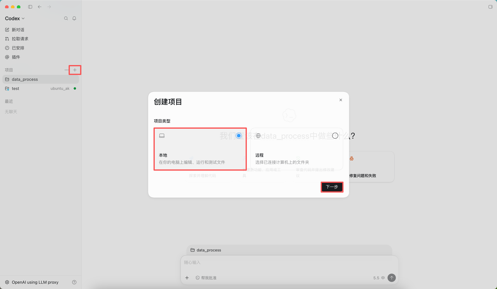
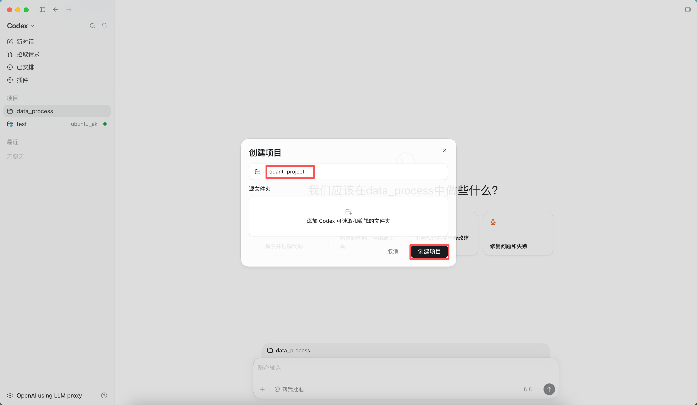
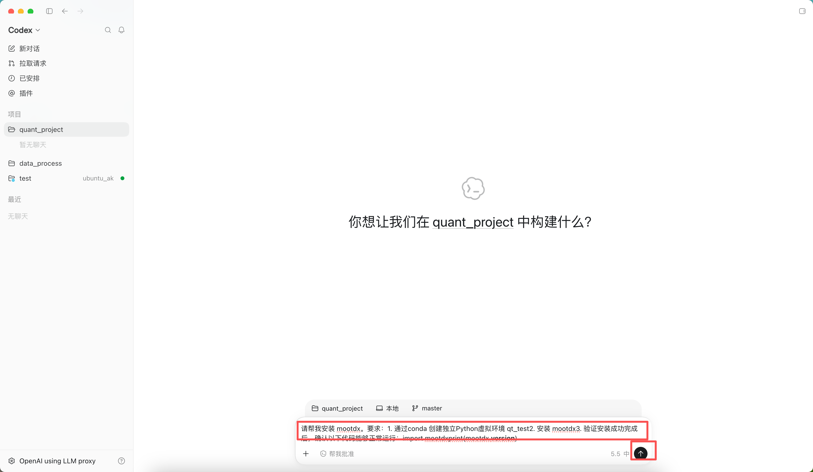
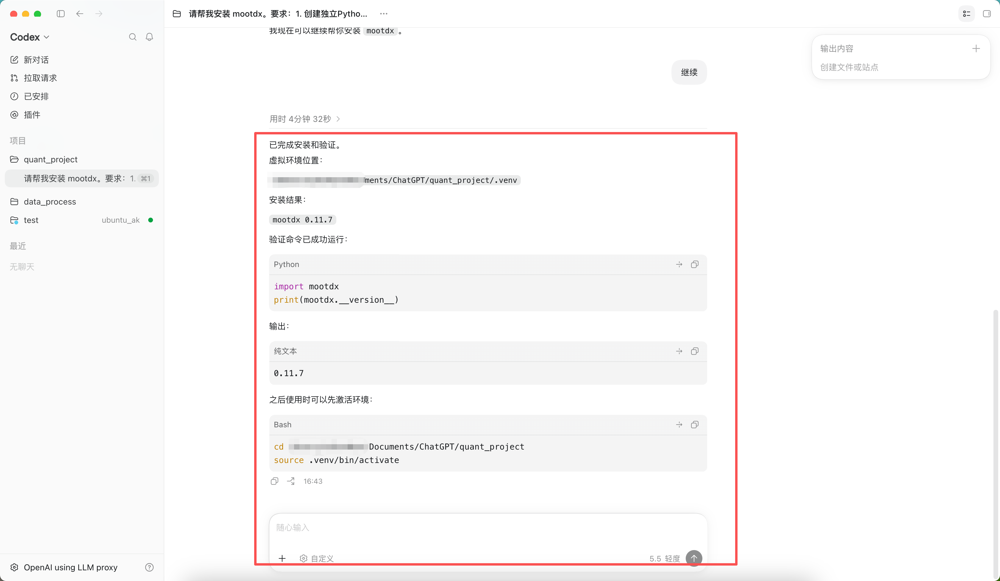
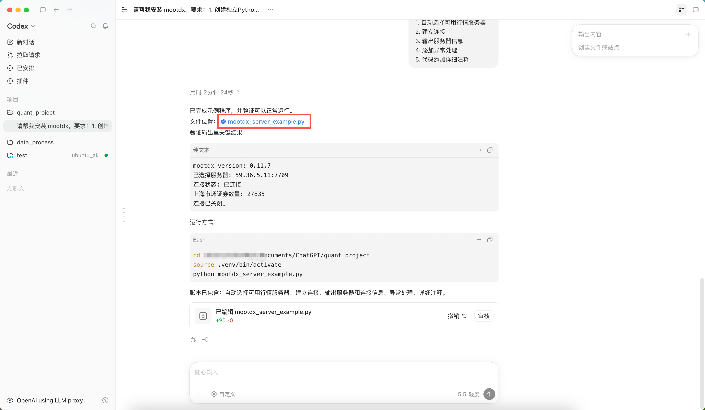
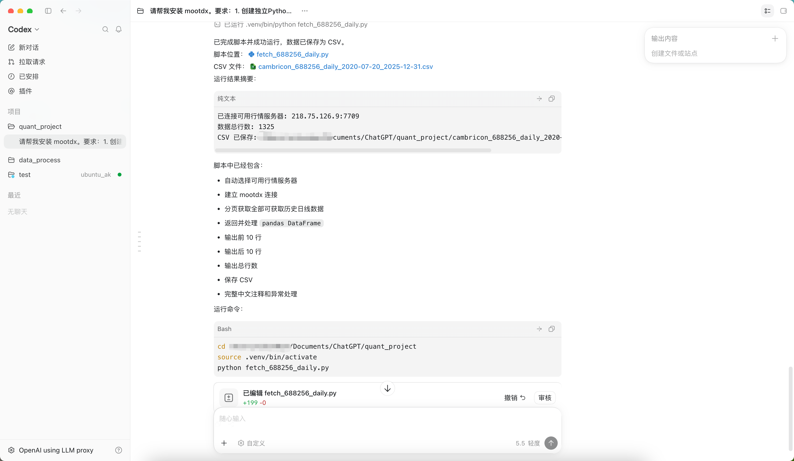
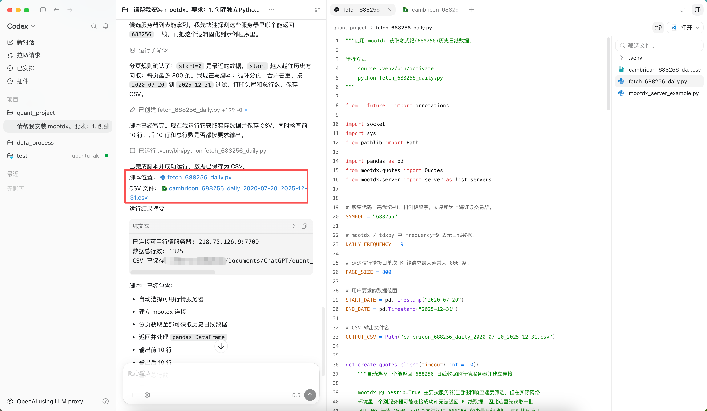

# 第一章：解码寒武纪（688256.SH）的收益与风险

本章，我们将正式进入量化交易的实战阶段。

作为一名量化研究员，当面对一只股票时，我们不会先听消息、看论坛或者猜测未来，而是先做一件事：

> **获取数据。**

因为所有的收益、风险、趋势和规律，都隐藏在历史数据之中。

本章，我们将以中国 AI 芯片代表企业——**寒武纪（688256.SH）** 为研究对象，使用 Python 编程语言与 AI 协同工具（Codex），亲手分析其自上市以来的真实交易数据。

---

# 任务一：获取寒武纪历史数据

在量化交易领域，有一句非常经典的话：

> Garbage In, Garbage Out.
>
> （垃圾数据产生垃圾结果。）

因此，任何研究开始之前，第一件事都是获得可靠的数据。

在 A 股市场中，很多交易软件（例如通达信）都会维护自己的行情数据库。

而 Python 社区已经有人把这些数据接口封装成了现成的库。[开源项目地址](https://github.com/mootdx/mootdx)

本课程将使用：```mootdx``` 来获取真实的 A 股历史行情数据。 

| 在这之前请确保自己已经完成了[环境安装](https://github.com/hitsz-ids/AI-Course/blob/main/Quantitative_Trading/1-%E7%8E%AF%E5%A2%83%E5%AE%89%E8%A3%85/README.md)
---
## 创建项目




## 步骤1：安装 mootdx

请向 Codex 提出以下需求：

```yaml
请帮我安装 mootdx。

要求：
1. 创建独立Python虚拟环境.
2. 安装 mootdx.
3. 验证安装成功.

完成后，确认以下代码能够正常运行：

import mootdx
print(mootdx.__version__)
```

后面 Codex 就会根据我们的要求帮我们安装Python，创建虚拟环境，然后安装mootdx




等待一会即可安装完成



> 如果遇到权限问题参考 [环境安装](https://github.com/hitsz-ids/AI-Course/blob/main/Quantitative_Trading/1-%E7%8E%AF%E5%A2%83%E5%AE%89%E8%A3%85/README.md) 修改权限

---

## 步骤2：连接行情服务器

接下来，我们需要连接通达信行情服务器。

请向 Codex 提出：

```text
使用 mootdx 编写示例程序：

1. 自动选择可用行情服务器
2. 建立连接
3. 输出服务器信息
4. 添加异常处理
5. 代码添加详细注释
```

Codex会帮我们写脚本，运行程序，确认连接成功。


---

## 步骤3：获取寒武纪日线数据

寒武纪股票代码：```688256```
市场：```上海证券交易所```

请向 Codex 提出：

```text
使用 mootdx 获取寒武纪（688256）的历史日线数据。

数据范围：
2020-07-20 到2025-12-31

要求：
1. 获取全部可获取历史数据
2. 返回 pandas DataFrame
3. 输出前10行
4. 输出后10行
5. 输出数据总行数
6. 保存为 CSV 文件
7. 代码中添加完整注释
```

等待一会，我们需要的下载脚本和寒武纪2020-2025年数据就下载好了。


我们也可以点击文件查看下载脚本以及下载的股票数据



---

## 任务二：看看股价是怎么变化的

在查看股票数据的过程正，我们发现直接查看数字表格并不直观。

接下来，我们把数据画成图。

### 操作步骤

向 Codex 输入：

```text
读取寒武纪历史数据，

绘制收盘价走势图。

要求：

1. 横轴为日期
2. 纵轴为收盘价
3. 显示完整历史走势
```

画图过程中需要下载 Python画图需要的库，我们耐心等待即可


经过一段时间的等待，Codex就帮我们创建了Python程序，并通过刚才下载的数据生成了下面的折线图。


这里生成的图表可能会出现中文显示问题，也可以尝试使用下面的指令让Codex修复

``` text
生成的图片中文显示是乱码，帮我修复
```

---

### 观察与思考

看到图之后，请思考：

#### 问题1

寒武纪的走势是平稳上涨的吗？
还是经历了剧烈波动？

---

#### 问题2

如果你在最高点买入，之后股价腰斩，你还能继续持有吗？

---

#### 问题3

如果你在最低点附近买入，后来上涨数倍，你会不会提前卖掉？

---

## 任务三：寻找最疯狂的交易日

走势图只能看到整体趋势。

接下来，我们看看哪些交易日最特殊。

### 操作步骤

向 Codex 输入：

```text
基于寒武纪历史数据：

计算每日涨跌幅。

找出：

1. 涨幅最大的10个交易日
2. 跌幅最大的10个交易日

输出：

日期
涨跌幅
收盘价
```

模型输出：
```markdown
涨幅最大的 10 个交易日:
      date  daily_return   close
2020-07-21         29.00  274.00
2023-03-17         20.00  122.93
2024-10-18         20.00  429.71
2024-07-16         20.00  249.84
2025-08-12         20.00  848.88
2023-10-19         20.00  144.24
2025-08-22         20.00 1243.20
2023-04-20         20.00  266.16
2025-02-21         20.00  742.21
2024-10-08         20.00  346.99

跌幅最大的 10 个交易日:
      date  daily_return   close
2023-10-23        -20.00  108.44
2022-03-15        -18.38   66.02
2025-01-16        -14.65  594.00
2025-09-04        -14.45 1202.00
2023-06-21        -13.49  230.98
2024-09-05        -13.48  206.90
2023-06-26        -12.33  202.50
2025-04-07        -11.42  565.16
2023-05-05        -10.66  207.98
2022-04-25         -9.99   50.00
```

---

### 观察与思考

此时你会发现：

有些交易日可能上涨超过：

```text
+15%
+20%
```

而有些交易日可能暴跌：

```text
-10%
-15%
```

那么问题来了：

> 到底发生了什么事情，能让市场在一天之内突然改变对一家公司的看法？

---

## 本章总结

经过本章学习，我们暂时不讨论复杂的量化模型。

只需要记住一个最重要的事实：

> 股票并不是一串代码，而是一群人对未来预期的集合。

而寒武纪过去几年惊人的上涨与下跌，正是市场预期不断变化的结果。

下一章，我们将开始量化这种变化：

> 用收益率和波动率两个指标，衡量寒武纪到底赚了多少钱，又承担了多大的风险。

[第二章：量化衡量寒武纪（688256.SH）的收益与风险](./chapter_2.md)