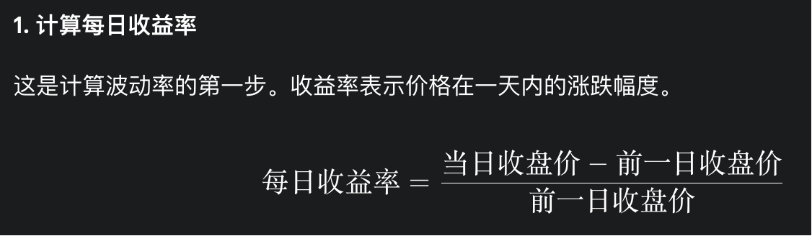
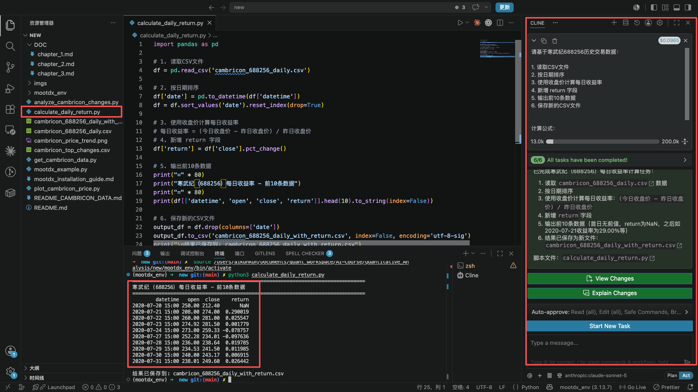
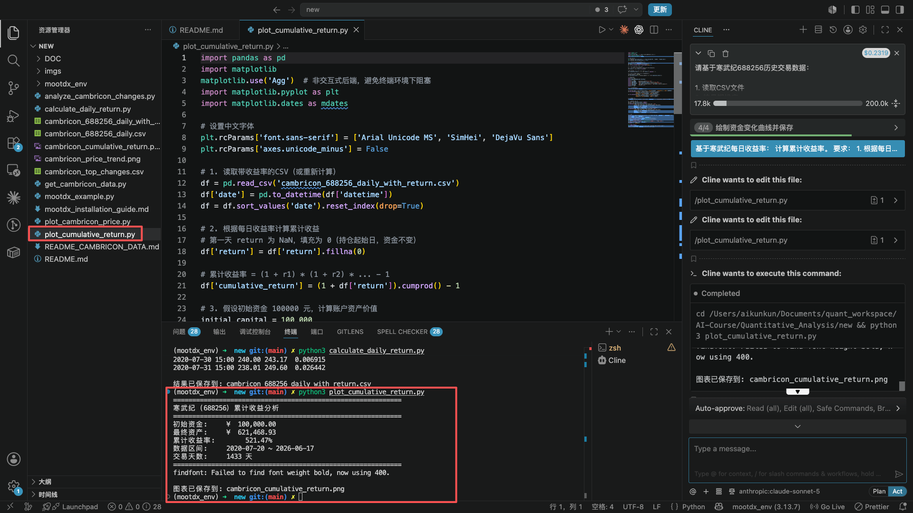
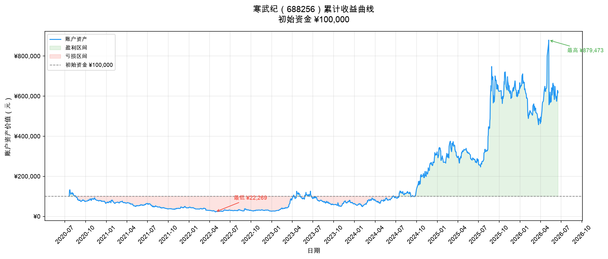
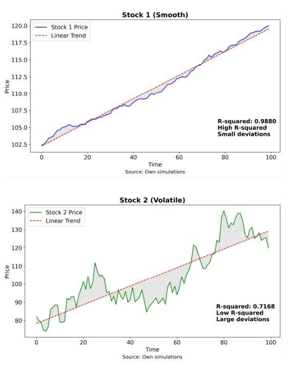
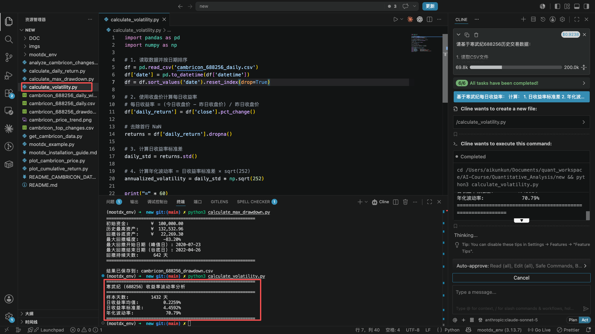

# 第二章：量化衡量寒武纪（688256.SH）的收益与风险

在第一章中，我们已经通过真实数据看到了寒武纪上市以来的价格变化。

我们发现：

股票价格并不是简单的一条上涨曲线。

它经历了：

* 快速上涨阶段
* 大幅调整阶段
* 长时间震荡阶段

但是，仅仅观察走势图还不够。

例如：

两只股票过去五年都上涨了200%。

它们真的一样好吗？

可能并不一样。

第一只股票：

* 每年稳定上涨
* 很少出现大幅波动

第二只股票：

* 经常暴涨暴跌
* 中间经历多次腰斩

虽然最终收益相同，但是投资者承担的风险完全不同。

因此，量化投资首先需要回答两个问题：

> **我们赚了多少？**

以及：

> **为了获得这些收益，我们承担了多少风险？**

这就是量化投资中最基础的两个维度：

* 收益（Return）
* 风险（Risk）

本章，我们将使用 Python 对寒武纪进行量化分析。

---

# 任务一：计算每日收益率

## 任务目标

在第一章中，我们看到的是：

股票价格变化。

但是投资者真正关心的是：

> 每一天持有股票，账户价值变化了多少。

例如：

股票价格：

```
100元 → 110元
```

价格上涨：

```
+10元
```

但是投资收益：

```
+10%
```

因此，我们需要把价格转换成收益率。

计算公式：



---

## 操作步骤

### Step 1：读取第一章数据

使用第一章生成的：

```
cambricon_688256_daily.csv
```

数据包含：

* 日期
* 开盘价
* 最高价
* 最低价
* 收盘价
* 成交量

---

### Step 2：让 Cline 计算每日收益率

输入：

```
请基于寒武纪688256历史交易数据：

1. 读取CSV文件
2. 按日期排序
3. 使用收盘价计算每日收益率
4. 新增 return 字段
5. 输出前10条数据
6. 保存新的CSV文件

计算公式：
每日收益率 = (当日开盘价 - 当日收盘价) / 前一日收盘价
```


---



完成后：


```text
        datetime   open  close    return
2020-07-20 15:00 250.00 212.40  0.150400
2020-07-21 15:00 208.00 274.00 -0.317308
2020-07-22 15:00 260.00 281.00 -0.080769
2020-07-23 15:00 274.92 281.50 -0.023934
2020-07-24 15:00 273.00 259.33  0.050073
2020-07-27 15:00 252.28 234.01  0.072420
2020-07-28 15:00 236.00 238.64 -0.011186
2020-07-29 15:00 234.53 241.50 -0.029719
2020-07-30 15:00 240.00 243.17 -0.013208
2020-07-31 15:00 238.01 249.60 -0.048695
```

---

## 思考问题

为什么不能直接比较股票价格？

例如：

股票A：

```
100元 → 150元
```

股票B：

```
1000元 → 1200元
```

价格变化：

股票A：+50元

股票B：+200元

从收益率看：

股票A：+50%

股票B：+20%

如果只看收益金额 股票B 赚的更多，但是忽略了 股票B 实际投入了 `1000元`，股票A只投入了 `100元`。因此：

> 收益率才是衡量投资表现的标准。

---

# 任务二：计算寒武纪累计收益曲线

## 任务目标

单日涨跌容易让人迷惑。

例如：

今天上涨10%，明天下跌10%。最终并不是回到原点，而是亏损了。

> 假设初始金额 100 元：第一天 +10% → 110 元；第二天 -10% → 99 元。最终亏损 1 元。

因此，我们需要观察：

> 如果投资者从交易股票第一天开始持有，到今天资金变化如何。

---

## 操作步骤

输入：

```
基于寒武纪每日收益率：

计算累计收益率。

要求：

1. 随机从已有数据选取一天作为开始
2. 根据每日收益率计算累计收益
3. 假设初始资金100000元
4. 绘制资金变化曲线

要求：

横轴：日期

纵轴：账户资产价值
```


---

计算逻辑：

假设：

初始资金：

```
100000元
```

每天根据收益率变化：

例如：

第一天：

```
100000 × (1+5%)
=105000
```

第二天：

```
105000 × (1-3%)
=101850
```

最终得到：


---

## 思考问题

观察累计收益曲线：

回答：

1. 寒武纪最大的上涨阶段是什么时候？

2. 最大下跌阶段是什么时候？

3. 如果你不是上市第一天买入，而是在高点买入，结果是否一样？

---

# 任务三：计算最大回撤

## 任务目标

收益之外，还有一个投资者最关心的问题：

> 我最多亏过多少？

这就是：

## 最大回撤（Maximum Drawdown）

---

公式：

```text
最大回撤 = MAX（ 所有交易日各自的【（历史最高净值 − 当日净值）÷ 历史最高净值】 ）× 100%
```


例如：

股票最高达到：

```
100元
```

后来跌到：

```
50元
```

那么：

最大回撤：

```
最大回撤 = (50 - 100) / 100 × 100% = -50%
```


---

## 操作步骤

输入：

```
基于寒武纪累计收益曲线：

计算最大回撤。

要求：

1. 计算历史最高资产
2. 计算每日回撤比例
3. 找出最大回撤
4. 输出最大回撤开始日期
5. 输出最大回撤结束日期
```

---

输出示例：

```
============================================================
寒武纪（688256）最大回撤分析
============================================================
初始资金:         ¥  100,000.00
历史最高资产:     ¥  132,532.96
回撤谷底资产:     ¥   22,269.30
最大回撤幅度:          -83.20%
最大回撤开始日期（峰值日）: 2020-07-23
最大回撤结束日期（谷底日）: 2022-04-26
回撤持续天数:      642 天
============================================================
```

---

## 思考问题

假设：

你投资：

```
100万元
```

经历：

```
最大回撤 -50%
```

账户：

```
100万

↓

50万
```

你还能继续持有吗？

想一想，如果从50万开始，收益率达到多少才能回到100万

这就是为什么：

> 风险管理比寻找收益更加重要。

---

# 任务四：计算股票波动率

## 任务目标

收益告诉我们：股票赚了多少。

但收益高的股票，往往伴随着剧烈的价格起伏，持有过程可能并不"舒服"。

于是我们需要观察：股票每天波动有多剧烈。

这就是：

## 波动率（Volatility）

在金融学中，波动率的正式定义是：

> **每日收益率的标准差。**

通俗理解：如果一只股票每天涨跌幅度都很小，它的标准差就小，波动率低；如果经常暴涨暴跌，标准差就大，波动率高。

下面两张图展示了两种截然不同的股票走势：

- **Stock 1**：走势平稳，每天涨跌幅度较小，波动率低。
- **Stock 2**：上蹿下跳，价格起伏剧烈，波动率高。



虽然两只股票在统计周期内的累计收益可能相同，但**Stock 2**需要投资者承受更大的心理压力，也意味着更高的不确定性。

在接下来的任务中，我们就要用 Python 计算出寒武纪的波动率——看看它更接近哪一种类型。

---

## 操作步骤

输入：

```
基于寒武纪每日收益率：

计算：

1. 日收益率标准差
2. 年化波动率


公式：

年化波动率 =
每日收益率标准差 × sqrt(252)

```
> 说明：252 代表 A 股市场一年的交易日数量（约 252 天）。因为我们要把"每日波动"换算成"每年波动"，所以乘以 √252。

---

输出示例：
```
======================================================
寒武纪（688256）收益率波动率分析
======================================================
样本天数:         1432 天
日收益率均值:          0.2259%
日收益率标准差:        4.4592%
年化波动率:             70.79%
======================================================
```


---

# 任务五：计算夏普比率

## 回顾一下：我们刚才干了什么？

经过前面几个任务，我们手里有了两个关于股票的"体检指标"：

- **收益（收益率）**：告诉我们"赚了多少"。数字越大，说明这只股票越能帮你挣钱。

- **风险（波动率/标准差）**：告诉我们"波动多大"。数字越大，说明这只股票上蹿下跳得越厉害，持有它需要一颗更强的心脏。

现在问题来了——

如果股票A**收益高但波动也大**，股票B**收益低但波动也小**，你到底该选哪一只？

光看收益，A赢了；光看波动，B赢了。

那有没有一个办法，把**收益**和**风险**放在一起看，算出一个综合分数，让你能直观地判断："这只股票承担了多少波动，换回了多少收益"？

有。这个综合分数，就叫 **夏普比率（Sharpe Ratio）**。

简单来说：

> **夏普比率 = 投资的性价比**

它回答的问题是：**“我每承担一单位的波动风险，能换来多少超额回报？”**

数值越高，说明这笔投资“物有所值”——冒同样的风险，赚得更多；

数值越低，说明你冒了很大的风险，却没赚到多少——这笔买卖不太划算。


---

公式：

```
夏普比率 = （投资组合的收益率 − 无风险收益率） ÷ 投资组合收益率的标准差
```


把每个符号拆开翻译：

| 中文术语 | 含义 |
| :--- | :--- |
| **投资组合的收益率** | 你持有的基金或股票（比如你只买了寒武纪这一只股票）在统计期内的平均收益率，通常用**年化收益率** |
| **无风险收益率** | 理论上不承担风险就能获得的回报，如**同期国债收益率**或**银行定期存款利率** |
| **投资组合收益率的标准差** | 衡量收益率的**波动程度**，波动越大，代表风险越高 |
| **夏普比率** | **每承受一单位风险（波动），能获得多少超额收益** |


需要说明的是，无风险收益率并非固定不变的常数——国债收益率和银行不同期限（1年、3年、5年）的定期存款利率，每年都会随市场环境调整。

为便于后续计算演示，本教程统一假定统计周期为2026年，并采用当年五年期银行定期存款利率作为无风险收益率参考值：

---

## 操作步骤

输入：

```
基于寒武纪历史数据：

计算夏普比率。


要求：

无风险收益率为 1.4%

输出：

1. 年化收益率
2. 年化波动率
3. 夏普比率
```

---

输出示例：

```
======================================================
寒武纪（688256）夏普比率分析
======================================================
数据区间:         2020-07-20 ~ 2026-06-17
样本天数:         1432 天
累计收益率:            521.47%
------------------------------------------------------
无风险收益率:            1.40%
年化收益率:             37.92%
年化波动率:             70.79%
夏普比率:              0.5159
======================================================
```

---

# 任务六：比较收益和风险

现在我们已经可以评价一家公司。

假设：

| 公司  | 年化收益 | 年化波动 | 夏普比率 |
| --- | ---- | ---- | ---- |
| A公司 | 30%  | 15%  | 2.0  |
| B公司 | 50%  | 80%  | 0.6  |

如果只看收益：

B公司更优秀。

但是：

B公司意味着：

* 更大的价格波动
* 更严重的心理压力
* 更大的资金回撤风险

因此：

量化投资不是简单寻找：

> 涨得最多的股票。

而是寻找：

> 收益和风险之间最优平衡。

---

# 第二章总结

经过第二章的学习，我们完成了从“观察价格”到“量化评价”的跨越：

## 第一章：

```
股票价格
↓
走势图
↓
观察变化
```

## 第二章：

```
股票价格
↓
收益率
↓
累计收益
↓
风险指标
↓
投资评价
```

现在，我们已经可以回答：

* 寒武纪历史赚了多少？
* 年化收益是多少？
* 最大亏损是多少？
* 波动风险有多大？
* 这笔投资是否值得承担这些风险？

---

## 从“分析一只股票”到“构建一个策略”

在进入第三章之前，我们先来理解一个关键概念：**什么是量化交易？**

简单来说：

> **量化交易 = 用数据和规则来做投资决策，而不是凭感觉或经验。**

传统的投资方式可能是：看新闻、听专家推荐、凭直觉判断“这只股票会不会涨”。

量化交易的方式则是：

1. 提出一个假设（比如“过去涨得好的股票，未来一段时间可能继续涨”）
2. 把这个假设变成可计算的规则（比如“过去12个月收益率排名前10%的股票”）
3. 用历史数据验证这个规则是否有效（回测）
4. 如果有效，就把它变成一个可重复执行的策略

这就是我们在第三章要做的事情。

第三章将沿用你在前二章学到的所有技能——收益率计算、波动衡量、数据可视化——但把它们应用到更大的数据集（沪深300的300只股票）上，构建一个完整的投资组合策略。

带着这些思考？让我们开始下一章。
[第三章：动量策略实战——从选股到模拟交易](./chapter_3.md)

---


