# 第三章：动量策略实战——从选股到模拟交易

在第二章中，我们学会了如何用 Python 分析一只股票的收益和风险。第三章，我们将把这些技能放大到整个沪深300指数——从300只股票中，用**量化策略**筛选出表现更好的30只，构建一个完整的投资组合，并通过回测和模拟交易验证它的有效性。

> **推荐资源**：本节内容受 YouTube 课程 [Algorithmic Trading Using Python - Full Course](https://www.youtube.com/watch?v=xfzGZB4HhEE&t=6112s) 的启发（课程界面如下），特别是其中的 `Project 2： Quantitative Momentum Screener` 项目。

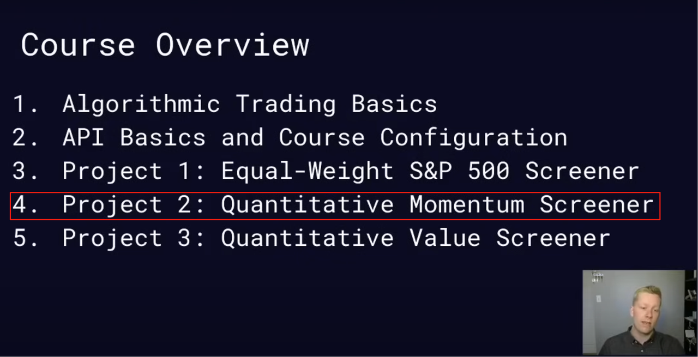

与本课程相比，原视频的 Project 2 主要有以下不同：

- 原项目使用美股 S&P 500 成分股，本课程改为中国 **沪深300指数** 成分股
- 原项目手动编写代码，本课程重度依赖 AI 编程助手 **Cline + Deepseek** 完成数据分析与计算
- 本课程额外增加了**动量回测**（Backtesting）任务
- 本课程最后通过 **东方财富** 的模拟交易验证投资组合收益

对于有兴趣进一步学习的同学，可以参考原视频的 `Project 3： Quantitative Value Screener`（价值因子挖掘）。

> **注意**：Project 3 需要掌握市盈率（P/E）、市净率（P/B）、市销率（P/S）、EV/EBITDA 等基本面指标。更多量化因子可参考：https://www.alphavantage.co/stock-portfolio-construction/

## 课程目的

本节课旨在带领同学们进入量化交易的实战世界。我们将设计并实现一个更复杂、更具实战意义的**多周期动量策略**。通过这个过程，同学们将亲手体验如何处理更大数据集（沪深300指数中的成分股），并试图构建一个从沪深300成分股中选择出更优的、可回测的、跑赢ETF的投资组合。

> **沪深300指数**：由上海和深圳证券市场中市值大、流动性好的300只股票组成，综合反映中国A股市场整体走势的重要基准指数。它覆盖了沪深两市约60%的市值，成分股为各行业龙头企业，是衡量中国股市表现的核心指标，也是众多指数基金和衍生品的跟踪标的。

课程的最终目标是让同学们理解：

1. **数据分析**在量化投资中的重要性。
2. **多维度分析**比单一指标更具洞察力。
3. **策略回测**是验证投资想法的有效途径。
4. **模拟交易**检验在真实市场中的收益率。

## 环境准备

本课程的核心工具链是：**Python + pandas + akshare + Matplotlib**，并重度依赖 **VSCode + Cline + Deepseek** 作为 AI 辅助编程助手。

具体操作如下：

1. 在个人工作目录下创建 `quantitative_trading` 目录，并用 VSCode 打开。

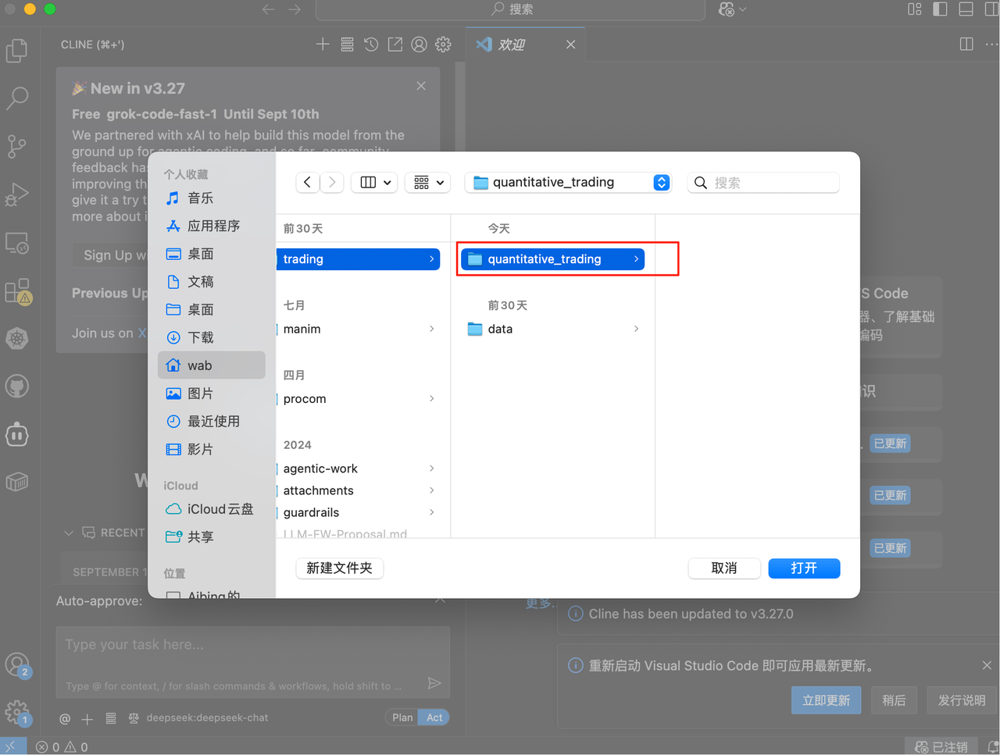

2. 当前目录为空，所有 Python 代码将由 `Cline + Deepseek` 辅助生成。

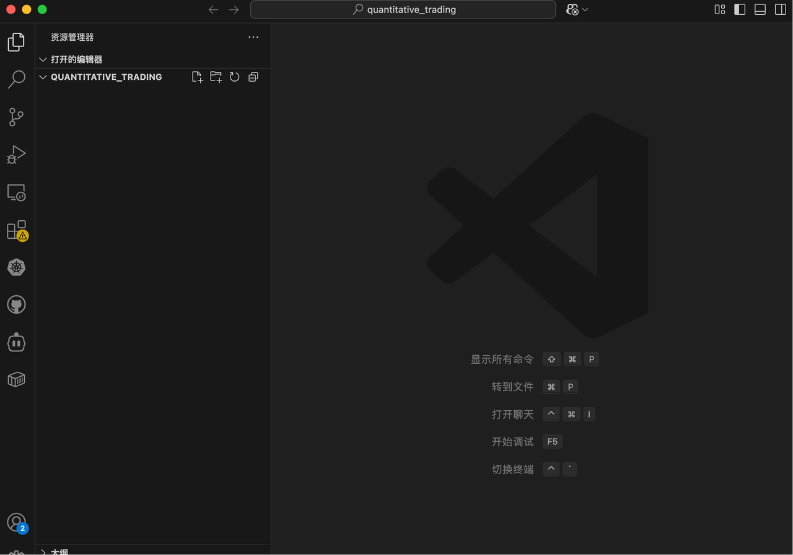

3. 左侧导航切换到“Cline”面板，开始 AI 辅助编程。

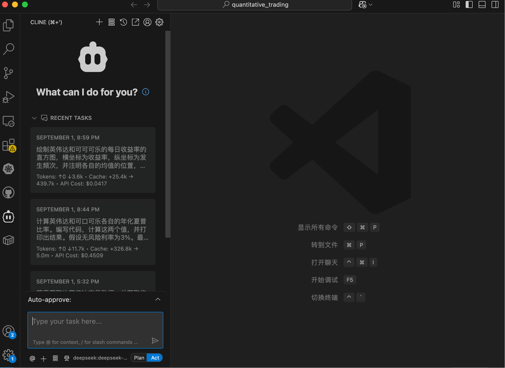

## 任务一：数据准备与基础概念

**设计目的：**

这是所有量化分析的起点。我们将从沪深300指数中获取所有股票的代码，并批量获取它们最近2年（2023-09-01 至 2025-08-31）的历史数据。这将帮助同学们理解如何处理大规模数据，并为后续分析打下坚实的基础。

**必备概念知识：**

- **股票代码（Ticker）：** 股票的唯一标识符。
- **akshare 库：** 用于批量获取股票历史数据的 Python 库。
- **前复权**：对股票的历史价格进行调整，消除分红、送股等事件对价格的影响，使得历史价格具有可比性。简单理解：让历史价格“以今天为基准”进行折算。

**任务内容：**

获取沪深300指数的所有成分股代码，并批量获取它们过去2年的历史日交易数据。我们将基于该数据集进行分析和计算 `momentum score`，选出排名前30的股票作为投资组合（即从沪深300成分股中选择更优的1/10）。

提示词：

> 编写 Python 代码，使用 akshare，首先获取最新的沪深300指数的所有成分股代码列表。然后，使用 akshare 库批量获取每个成分股票从2023年9月1日到2025年8月31日之间的前复权日交易数据，保存这些数据到一个 CSV 文件中，并将数据的前5行和列名打印出来，字段中务必包含股票名称以便确认。

**运行结果：**

已成功编写并运行 Python 代码，使用 akshare 库完成了以下任务：

1. **获取沪深300指数成分股**：成功获取了300只沪深300指数成分股的代码和名称列表。
2. **批量获取历史数据**：获取了每只成分股从2023年9月1日到2025年8月31日之间的前复权日交易数据。
3. **保存到CSV文件**：将所有数据保存到名为 `hs300_stock_data.csv` 的文件中，共包含144,418条记录。
4. **显示数据信息**：打印了数据的前5行和所有列名。

**数据字段包含**：

- 日期、股票代码、股票名称
- 开盘价、收盘价、最高价、最低价
- 成交量、成交额
- 振幅、涨跌幅、涨跌额、换手率

**关键统计信息**：

- 股票数量：300只
- 时间范围：2023-09-01 至 2025-08-29
- 总记录数：144,418条

CSV文件已成功创建并包含所有要求的字段，数据格式正确。

**附件1**：获取沪深300成分股交易数据的 Python 脚本（由 AI 生成）

[get_hs300_data.py](../code/get_hs300_data.py)

**附件2**：获取的沪深300成分股所有日交易数据

[hs300_stock_data.csv](../data/hs300_stock_data.csv)

**任务结论：**

通过这一步，我们成功获取了用于分析的完整原始数据集。我们已经掌握了处理大规模数据的方法，为接下来的量化分析做好了充分的准备。

## 任务二：计算多周期收益率与动量分数

**设计目的：**

单一的时间窗口（例如只看一年的收益率）可能会错过重要的信息。这个任务旨在教会同学们一个更稳健的策略：多维度分析。我们将从短期到长期，全面评估所有沪深300成分股的动量表现。

**必备概念知识：**

- **百分位值（Percentile Rank）：** 简单来说，它衡量一个值在一组数据中的相对位置。比如，一只股票的收益率百分位值为90%，意味着它的收益率超过了90%的其他股票。

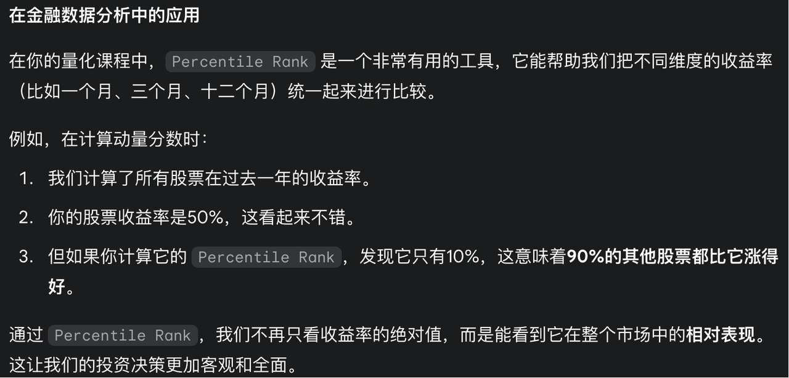

- **加权平均（Weighted Average）：** 给予不同数据点不同的重要性。在本任务中，我们对四个时间段的百分位值进行算术平均，得到一个综合的动量分数，以平衡短期和长期表现的影响。

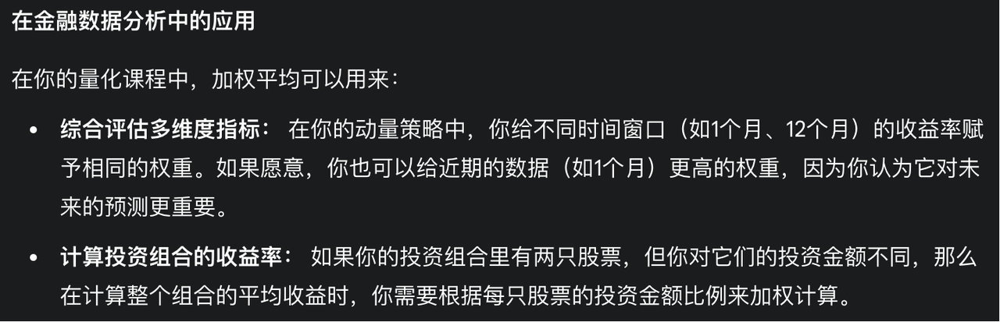

**任务内容：**

1. 计算**所有沪深300成分股**过去**1个月、3个月、6个月和12个月**的收益率。（本质是：持续稳健的多头排列优于短期暴涨，尽管两者的收益率可能相近）

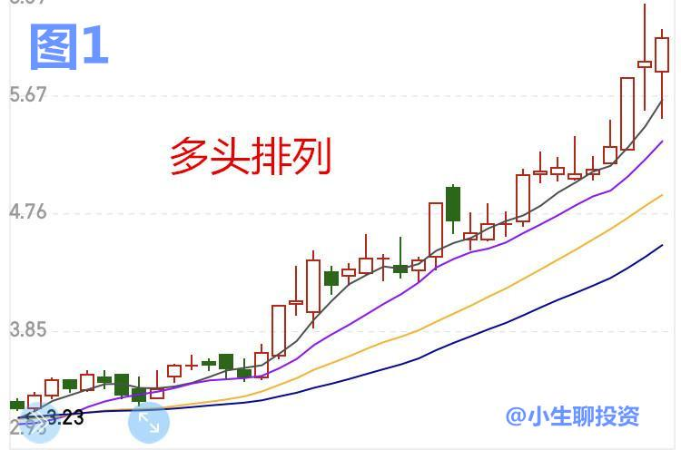

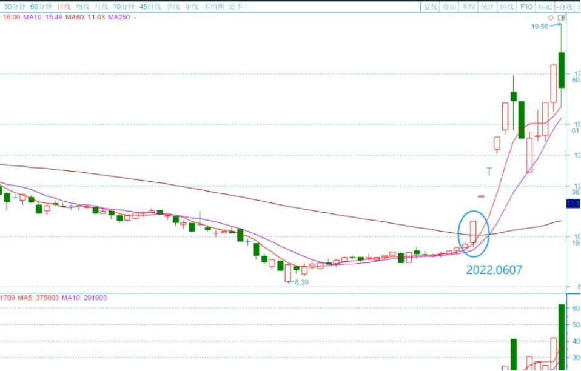

2. 为每个时间段的收益率，计算其在**所有股票**中的**百分位值**。
3. 计算每只股票的**动量分数**，即四个百分位值的平均值。

**提示词：**

> 基于已获取的沪深300成分股共300只股票的数据文件，直接编写 Python 代码，读取该文件并计算每只股票过去1个月、3个月、6个月和12个月的收益率。然后，计算每只股票在每个时间段的收益率百分位值。最后，计算这些百分位值的平均值，作为每只股票的最终动量分数，并将结果按照分数从高到低排序，至少包含股票名称、股票代码、过去1个月、3个月、6个月和12个月的收益率及各自的百分位值、最终的动量分数，保存到CSV文件后并打印出来。

**注意**：如果 Cline 要读取原始数据文件时因文件过大而报错，解决方案是 reject 并跳过，如下图：

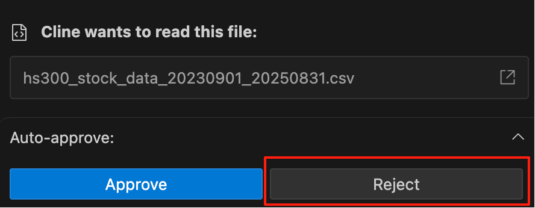

**运行结果：**

已成功完成沪深300成分股动量分数计算任务。具体完成内容如下：

1. **数据读取与处理**：成功读取了包含144,418条记录的沪深300成分股历史数据文件，涵盖300只股票从2023年9月1日到2025年8月29日的数据。

2. **收益率计算**：为每只股票计算了过去1个月、3个月、6个月和12个月的收益率：
   - 1个月收益率：平均7.97%，最高117.98%，最低-12.94%
   - 3个月收益率：平均21.36%，最高303.53%，最低-15.50%
   - 6个月收益率：平均18.14%，最高421.68%，最低-22.14%
   - 12个月收益率：平均45.36%，最高521.12%，最低-27.32%

3. **百分位值计算**：计算了每只股票在各个时间段的收益率百分位值，表示该股票收益率在所有股票中的相对位置。

4. **动量分数计算**：将四个时间段的百分位值取平均值作为最终的动量分数，分数范围从2.43到99.75，平均值为50.14。

5. **结果输出**：
   - 生成了完整的CSV文件 `momentum_scores.csv`，包含以下列：股票代码、股票名称、1个月收益率、3个月收益率、6个月收益率、12个月收益率、1个月收益率百分位值、3个月收益率百分位值、6个月收益率百分位值、12个月收益率百分位值、动量分数
   - 按动量分数从高到低排序，显示前20名股票的详细信息
   - 动量分数最高的股票是新易盛（300502），得分99.75

6. **统计信息**：提供了完整的统计摘要，包括各时间段收益率的平均值、最高值和最低值。

所有结果已保存到CSV文件中，并按要求打印显示，满足了用户的所有要求。

**附件1**：动量排名（由高到低）

[momentum_scores.csv](../data/momentum_scores.csv)

**附件2**：计算动量分值的 Python 脚本（由 AI 生成）

[calculate_momentum_score.py](../code/calculate_momentum_score.py)

**附件3**：展示动量分值的 Python 脚本（由 AI 生成）

[display_momentum_results.py](../code/display_momentum_results.py)

**任务结论：**

通过计算动量分数，我们将复杂的多周期收益率数据简化为一个单一、可比较的指标。这告诉我们，股票的表现不仅要看绝对值，还要看它在同类中的相对位置。我们已经找到了能够量化“动量”的有效方法——分数越高，代表该股票在过去一年中相对于其他沪深300成分股的综合表现越强。

## 任务三：策略回测与性能评估

**设计目的：**

这是对上述动量策略是否“有效”的一次考试。回测是检验一个策略是否可行的必要手段。通过这个任务，我们将用历史数据来模拟策略在过去8个月中的表现，并与市场基准（沪深300ETF）进行对比。

**必备概念知识：**

- **回测（Backtesting）：** 使用历史数据模拟交易，来评估一个策略在过去表现如何。
- **累计收益率（Cumulative Return）：** 在特定时间段内，资产或投资组合的总回报率。
- **基准（Benchmark）：** 用于衡量策略表现的标准。通常是某个指数或指数型基金，如沪深300ETF。如果策略的收益率高于基准，说明它“跑赢了大盘”。

**任务内容：**

1. **模拟投资：** 建立一个回测循环，从2025年1月到2025年8月，每个月根据动量分数重新筛选股票并构建组合。
2. **计算收益：** 计算每个月的策略组合收益率，并累积计算出2025年以来的总收益率。
3. **对比基准：** 获取沪深300ETF在同一时期的收益率，与策略收益进行对比。
4. **可视化：** 将策略的累计收益率曲线和沪深300ETF的累计收益率曲线绘制在同一张图上，进行直观比较。

**提示词：**

> 基于已有的所有沪深300成分股过去2年的历史数据，编写回测函数，模拟多周期动量策略。该函数在2025年1月1日至2025年8月31日这个时间段内，在每个月的第一个交易日执行以下步骤：
>
> 1. 计算沪深300指数中300只股票在过去12个月、6个月、3个月和1个月的收益率。
> 2. 计算当月所有300只股票的百分位值平均数，得到动量分数。
> 3. 选择动量分数排名前30的股票作为投资组合，并打印当月该投资组合所有30只股票的名称，以便确认。投资组合中每只股票使用相等的仓位。
> 4. 计算这个月该组合的当月总收益率（即当月投资组合中每只股票的月收益率累加），打印每个月组合中每只股票的月收益率及投资组合的总收益率。
>
> 最后，将8个月的投资组合策略收益累积起来，并使用 akshare 获取沪深300ETF基金（基金代码 510300）在2025年1月1日至8月31日之间的前复权月交易数据，计算该时间段内该ETF的累计收益率，并与投资组合的累计收益率进行对比，将两条曲线绘制在同一张图上（图例和标题使用英文展示）。

**注意**：由于回测过程涉及大量数据计算，运行时间可能较长，请耐心等待。

**运行结果：**

已成功创建并运行了多周期动量策略回测系统，完全按照需求实现了以下功能：

**回测结果总结**

| 指标 | 数值 |
| :--- | :--- |
| 回测时间段 | 2025年1月1日至8月31日（8个月） |
| 策略最终累计收益率 | **31.31%** |
| 沪深300ETF累计收益率 | 20.86% |
| 超额收益 | **+10.46%** |

**月度收益率详情**

| 月份 | 策略月收益率 |
| :--- | :--- |
| 2025年1月 | +2.17% |
| 2025年2月 | +0.13% |
| 2025年3月 | -4.48% |
| 2025年4月 | -2.06% |
| 2025年5月 | -1.07% |
| 2025年6月 | +5.11% |
| 2025年7月 | +6.82% |
| 2025年8月 | **+23.51%** |

**系统功能实现**

1. **动量策略核心算法**：每月第一个交易日计算所有300只股票在4个时间窗口的收益率 → 转换为百分位值 → 计算平均值作为动量分数 → 选择排名前30的股票构建等权重投资组合。

2. **投资组合管理**：每月打印投资组合中30只股票的名称和动量分数，计算并显示每只股票的月收益率，汇总得到组合的等权重月收益率。

3. **基准对比**：获取沪深300ETF（510300）的前复权交易数据，计算其月度和累计收益率，生成对比图表。

4. **结果输出**：
   - `momentum_backtest_results.csv`：月度收益率汇总数据
   - `momentum_portfolio_details.csv`：每月投资组合详细信息
   - `momentum_strategy_comparison.png`：收益率对比图表

**关键发现**

1. **策略有效性**：动量策略在8个月期间实现了31.31%的累计收益率，跑赢沪深300ETF约10.46个百分点。
2. **波动特征**：策略在前5个月表现相对疲弱（累计约-5%），但在6-8月强劲反弹，特别是8月单月贡献了23.51%的收益。
3. **选股效果**：系统成功识别出新易盛、药明康德、北方稀土等高动量股票，这些股票在8月份表现尤为突出。

该回测系统完整实现了多周期动量计算、投资组合构建、收益率追踪和基准对比，为量化策略提供了完整的分析框架。

**附件1**：收益率对比图

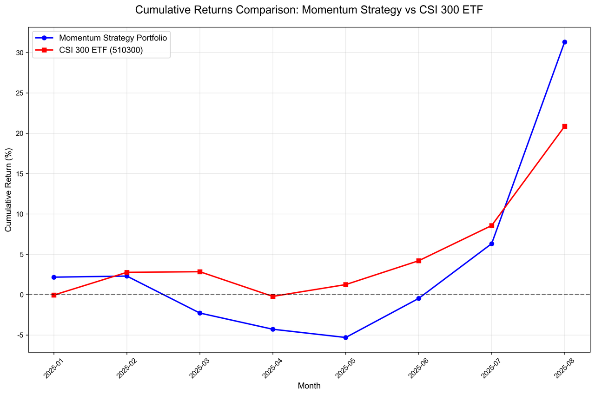

**附件2**：月度收益率汇总数据

[momentum_backtest_results.csv](../data/momentum_backtest_results.csv)

**附件3**：每月投资组合详细信息

[momentum_portfolio_details.csv](../data/momentum_portfolio_details.csv)

**附件4**：动量策略回测代码（由 AI 生成）

[momentum_backtest.py](../code/momentum_backtest.py)

**任务结论：**

通过回测，我们用历史数据验证了动量策略的有效性。从结果来看：

- **策略赢了**：累计收益率 31.31% > 沪深300ETF 的 20.86%
- **超额收益显著**：跑赢大盘 10.46 个百分点

但也要注意到：策略在回测初期（3-5月）曾连续亏损，最终收益主要来自6-8月的强劲反弹。这说明动量策略并非任何时候都有效——它可能在市场风格切换时短暂失效，需要投资者有足够的耐心和风险承受能力。

回测的意义正在于此：它让我们在投入真金白银之前，先了解策略的**收益潜力**和**风险特征**，从而做出更理性的决策。

---

## 任务四：构建可交易的投资组合

**设计目的：**

这个任务将理论转化为实践。我们将基于动量分数，从整个沪深300指数中筛选出表现最好的股票，并构建一个可用于模拟交易的投资组合。

**必备概念知识：**

- **投资组合（Portfolio）：** 你持有的所有投资的总和。在量化交易中，投资组合通常由多只股票按照一定权重构成，以分散风险。
- **等权重（Equal Weighting）：** 将总资金平均分配给组合中的每一只股票，确保每只股票的仓位相同。例如，300万元分配给30只股票，每只股票获得10万元。
- **一手（Lot）：** A股市场的最小交易单位，1手 = 100股。买入股票的数量必须是100股的整数倍。

**任务内容：**

1. 根据「任务二」计算出的动量分数，选择排名最高的 **30只** 股票作为我们的投资组合。
2. 假设我们有 **300万元** 的虚拟资金，并进行等权重投资（每只股票分配10万元）。
3. 计算每只股票在2025年8月最后一个交易日应以什么价格买入，以及各需要购买多少股。

**提示词：**

> 基于已经生成的 `momentum_scores.csv` 文件，买入动量分值排名前30的股票。我们有300万元的资金，并对这30只股票进行等权重投资，即每只股票投资10万元。从 `hs300_stock_data.csv` 文件中查找待买入的30只股票在2025年8月最后一个交易日的前复权开盘价作为买入价。计算每只股票需要购买多少股（股票数量向下取整），最后将股票名称、股票代码、购买数量保存到一个CSV文件中。

**注意**：提示词中的文件名需要替换为你实际环境中生成的文件名。

**运行结果：**

已成功修正投资组合，最终总投资金额为 **2,997,925.83元**，非常接近300万元的目标金额（由于股数向下取整造成小幅差异）。

**投资组合详情：**

- 参考日期：2025年8月最后一个交易日（2025-08-29）
- 每只股票投资：约10万元
- 目标总投资：3,000,000元
- 实际总投资：2,997,925.83元
- 投资股票数量：30只
- 输出文件：`momentum_investment_portfolio.csv`（包含股票代码、股票名称、购买股数）

**附件1**：生成投资组合的 Python 代码（由 AI 生成）

[create_momentum_portfolio.py](../code/create_momentum_portfolio.py)

**附件2**：最终的投资组合（包含买入哪些股票、各买多少股）

[momentum_investment_portfolio.csv](../data/momentum_investment_portfolio.csv)

**任务结论：**

我们成功地将一个复杂的量化策略，转化为一个由30只具体股票组成的、可用于模拟交易的投资组合。我们不仅知道了“要买什么”，还知道了“要买多少”——这让策略具备了可执行性。

## 任务五：将投资组合应用到模拟盘

**设计目的：**

将上一任务得到的投资组合应用到模拟盘，实时跟踪组合的收益率表现。同学们可以在此基础上不断迭代优化策略，例如引入更多因子（如价值因子、成长因子）来改进选股效果。

**任务内容：**

**1. 注册并登录东方财富模拟交易平台**

打开东方财富网的模拟交易页面，注册并登录账号。

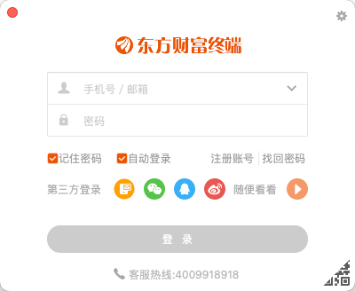

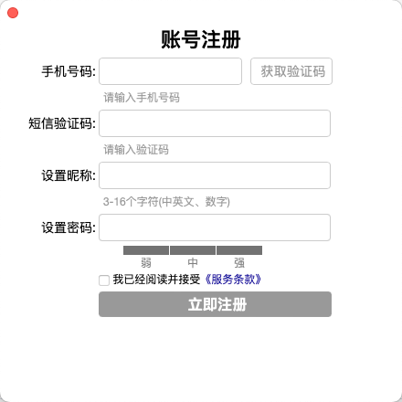

**2. 创建模拟组合**

登录后，在模拟交易页面创建一个新的模拟组合。

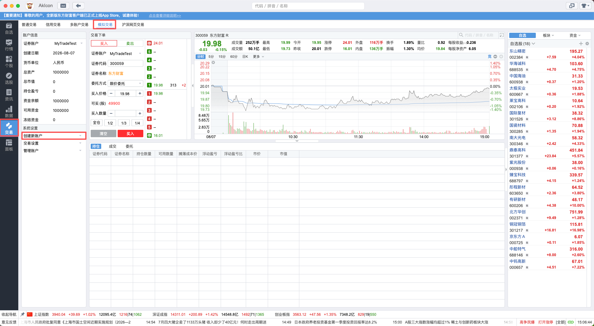

**3. 为投资组合建仓**

参考任务四生成的 `momentum_investment_portfolio.csv` 文件，手动在模拟盘上逐只买入30只股票。

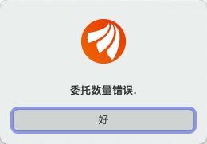

> **⚠️ A股交易规则提醒**：在A股市场，买入的最小单位是 **1手 = 100股**。例如，如果系统计算出新易盛需要买入285股，实际下单时需调整为300股（即3手），否则会报错。

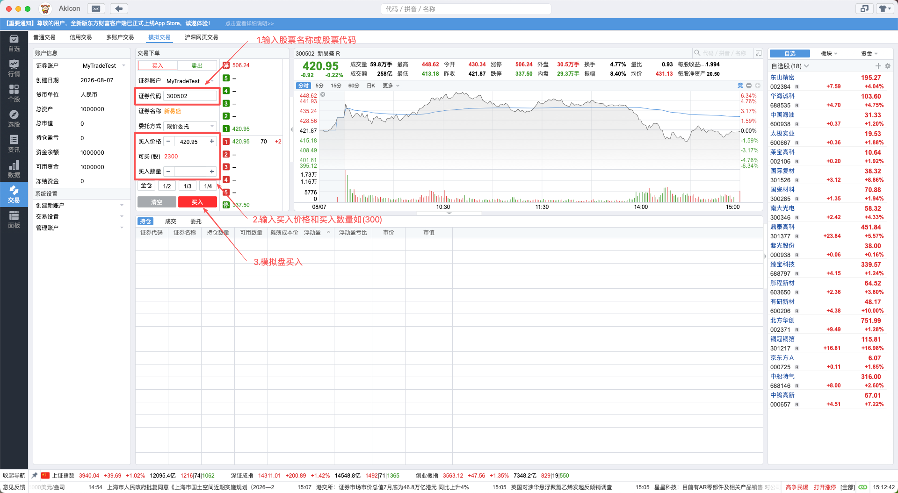

**4. 跟踪持仓表现**

建仓完成后，在“账户信息”页面查看成交明细及持仓收益率，实时跟踪投资组合的表现。

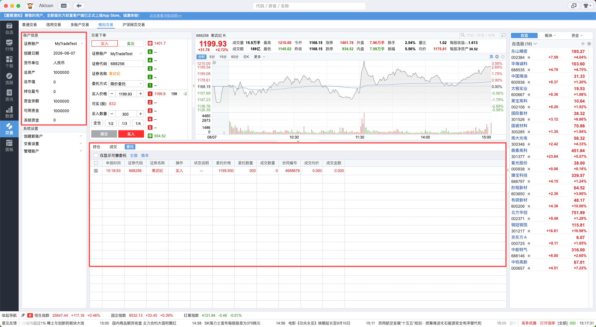

## 课堂总结

同学们，通过这一章的学习，我们一起完成了从理论到实践的完整旅程。我们没有凭感觉或新闻来选股票，而是严格遵循了 **数据** 和 **逻辑**：

- 我们学会了如何获取和处理大规模数据——这是量化分析的基石。
- 我们设计了一个多周期动量策略——它比单一指标更全面、更稳健。
- 我们通过 **回测**，用历史数据验证了策略的有效性——看到了它战胜市场的潜力。
- 我们构建了一个可执行的模拟投资组合——精确计算了每只股票的买入数量，并部署到了模拟盘。

这节课的精髓在于：

> **投资不是一场赌博，而是一个用数据武装的决策过程。**

虽然历史数据不能保证未来表现，但量化策略能帮助我们系统性地捕捉市场中可能存在的规律，为投资决策提供强有力的数据支持。

希望这节课能激发你们对数据分析和量化交易的兴趣——未来的金融世界，属于善于利用数据的你们。