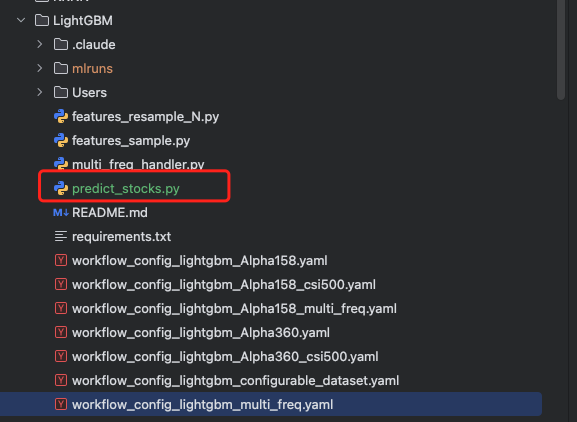
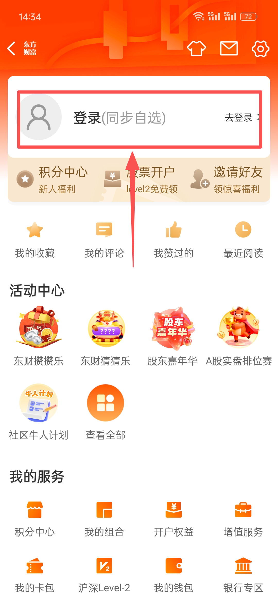
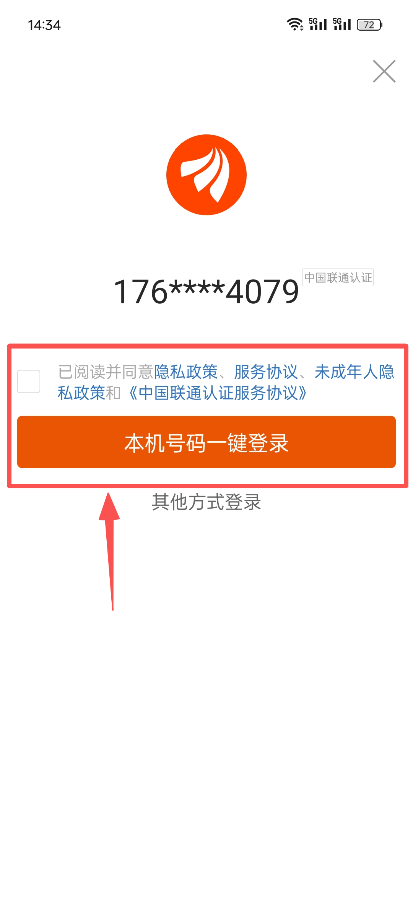
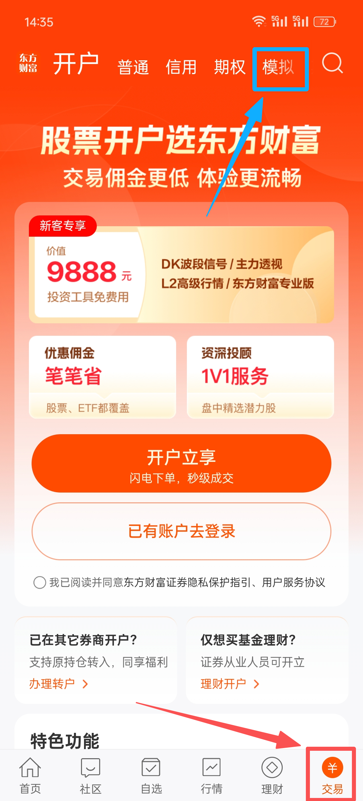
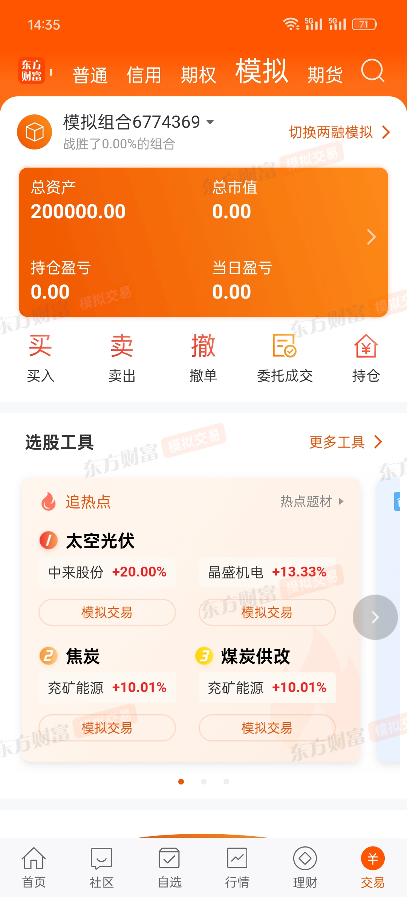
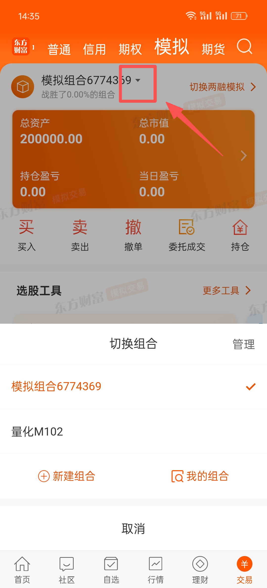
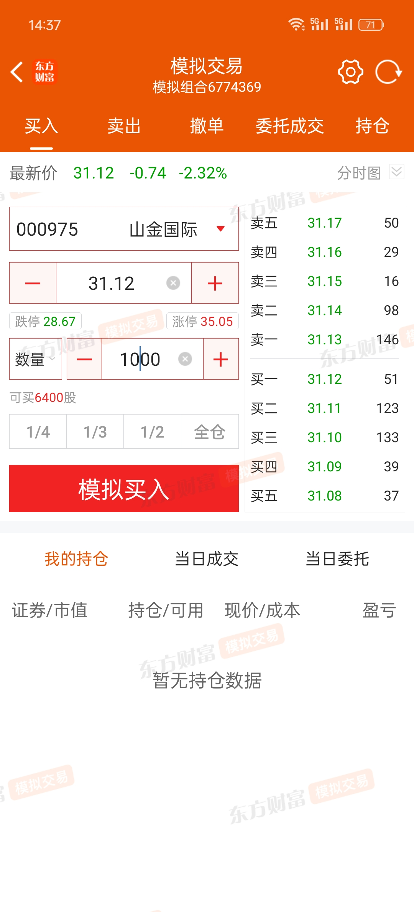
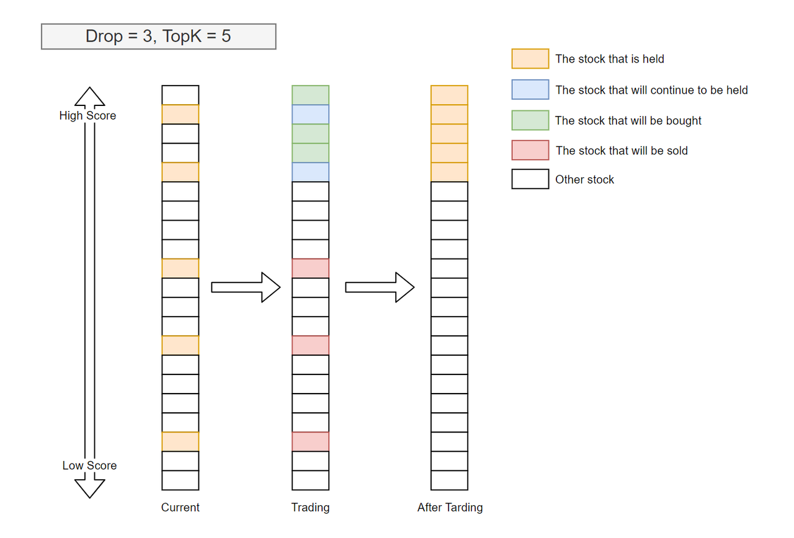

## 简介

本教程将带你完成一个完整的量化选股流程，使用 Qlib 框架和 LightGBM 模型，从数据准备到模型训练，再到实际预测选股。

### 什么是量化选股？

量化选股是通过数学模型和算法，从大量股票中自动筛选出具有投资价值的股票。本教程使用的流程是：

1. **特征工程**：从股票的历史数据中提取特征（如价格、成交量、技术指标等）
2. **模型训练**：使用机器学习模型学习哪些特征能预测股票未来收益
3. **预测选股**：使用训练好的模型对当前股票进行评分，选择得分最高的股票

### 本教程使用的技术栈

- **Qlib**：微软开源的量化投资平台
- **LightGBM**：微软开发的梯度提升决策树模型
- **Alpha158**：158个技术特征因子集

## 环境准备

### 1. 安装 Python 环境

确保你的系统已安装 Python 3.8 或更高版本。

### 2. 安装 Qlib

```Bash
pip install pyqlib
```

### 3. 下载股票数据

```Bash
wget https://github.com/chenditc/investment_data/releases/latest/download/qlib_bin.tar.gz
mkdir -p ~/.qlib/qlib_data/cn_data
tar -zxvf qlib_bin.tar.gz -C ~/.qlib/qlib_data/cn_data --strip-components=1
rm -f qlib_bin.tar.gz
```

这个命令会下载中国A股的历史数据（包括价格、成交量等），大约需要几分钟时间。

### 4. 验证安装

```Bash
python -c "import qlib; qlib.init(provider_uri='~/.qlib/qlib_data/cn_data', region='cn'); print('Qlib 安装成功！')"
```

## 动手实践

### 模型训练

**qlib源码下载:**

```Plain
git clone https://github.com/microsoft/qlib.git
```

**环境安装**

```Plain
#创建虚拟环境
conda create -n qlib python=3.12 -y
#激活虚拟环境
conda activate qlib
#进入源码目录
cd qlib
#执行环境安装脚本
pip install .
```

**执行训练命令：**

```Bash
cd qlib/examples/benchmarks/LightGBM
qrun workflow_config_lightgbm_Alpha158.yaml
```

**训练输出**

**执行训练命令：**

```Bash
cd /Users/caozk/Work/Quant/qlib/examples/benchmarks/LightGBM
qrun workflow_config_lightgbm_Alpha158.yaml
```

**训练输出**：

```SQL
(qlib) caozk@caozkdeMacBook-Pro examples % qrun benchmarks/LightGBM/workflow_config_lightgbm_Alpha158.yaml
[41500:MainThread](2026-01-04 15:17:22,503) INFO - qlib.qrun - [run.py:78] - Render the template with the context: {}
[41500:MainThread](2026-01-04 15:17:22,508) INFO - qlib.Initialization - [config.py:452] - default_conf: client.
[41500:MainThread](2026-01-04 15:17:22,509) INFO - qlib.Initialization - [__init__.py:75] - qlib successfully initialized based on client settings.
[41500:MainThread](2026-01-04 15:17:22,509) INFO - qlib.Initialization - [__init__.py:77] - data_path={'__DEFAULT_FREQ': PosixPath('/Users/caozk/.qlib/qlib_data/cn_data')}
/Users/caozk/opt/miniforge3/envs/qlib/lib/python3.12/site-packages/mlflow/tracking/_tracking_service/utils.py:178: FutureWarning: The filesystem tracking backend (e.g., './mlruns') will be deprecated in February 2026. Consider transitioning to a database backend (e.g., 'sqlite:///mlflow.db') to take advantage of the latest MLflow features. See https://github.com/mlflow/mlflow/issues/18534 for more details and migration guidance. For migrating existing data, https://github.com/mlflow/mlflow-export-import can be used.
  return FileStore(store_uri, store_uri)
[41500:MainThread](2026-01-04 15:17:22,520) WARNING - qlib.workflow - [expm.py:231] - No valid experiment found. Create a new experiment with name workflow.
[41500:MainThread](2026-01-04 15:17:22,523) INFO - qlib.workflow - [exp.py:258] - Experiment 535403520016716012 starts running ...
[41500:MainThread](2026-01-04 15:17:22,960) INFO - qlib.workflow - [recorder.py:345] - Recorder 4c5ba68417a54e218df1a8b93f0a7f3e starts running under Experiment 535403520016716012 ...
ModuleNotFoundError. CatBoostModel are skipped. (optional: maybe installing CatBoostModel can fix it.)
ModuleNotFoundError. XGBModel is skipped(optional: maybe installing xgboost can fix it).
ModuleNotFoundError.  PyTorch models are skipped (optional: maybe installing pytorch can fix it).
[41500:MainThread](2026-01-04 15:17:50,105) INFO - qlib.timer - [log.py:127] - Time cost: 26.554s | Loading data Done
[41500:MainThread](2026-01-04 15:17:50,524) INFO - qlib.timer - [log.py:127] - Time cost: 0.181s | DropnaLabel Done
[41500:MainThread](2026-01-04 15:17:51,431) INFO - qlib.timer - [log.py:127] - Time cost: 0.907s | CSZScoreNorm Done
[41500:MainThread](2026-01-04 15:17:51,440) INFO - qlib.timer - [log.py:127] - Time cost: 1.335s | fit & process data Done
[41500:MainThread](2026-01-04 15:17:51,440) INFO - qlib.timer - [log.py:127] - Time cost: 27.890s | Init data Done
Training until validation scores don't improve for 50 rounds
[20]    train's l2: 0.980547    valid's l2: 0.993311
[40]    train's l2: 0.973101    valid's l2: 0.993647
[60]    train's l2: 0.966056    valid's l2: 0.99465
Early stopping, best iteration is:
[20]    train's l2: 0.980547    valid's l2: 0.993311
[41500:MainThread](2026-01-04 15:17:59,666) INFO - qlib.fill_placeholder - [__init__.py:798] - <PRED> lookes like a placeholder, but it can't match to any given values
Gym has been unmaintained since 2022 and does not support NumPy 2.0 amongst other critical functionality.
Please upgrade to Gymnasium, the maintained drop-in replacement of Gym, or contact the authors of your software and request that they upgrade.
Users of this version of Gym should be able to simply replace 'import gym' with 'import gymnasium as gym' in the vast majority of cases.
See the migration guide at https://gymnasium.farama.org/introduction/migration_guide/ for additional information.
[41500:MainThread](2026-01-04 15:17:59,915) INFO - qlib.workflow - [record_temp.py:198] - Signal record 'pred.pkl' has been saved as the artifact of the Experiment 535403520016716012
'The following are prediction results of the LGBModel model.'
                          score
datetime   instrument          
2017-01-03 SH600000   -0.042564
           SH600005   -0.116470
           SH600008   -0.005617
           SH600009    0.025581
           SH600010    0.001895
Downloading artifacts:   0%|                                                                  | 0/1 [00:00<?, ?it/s]
Downloading artifacts: 100%|█████████████████████████████████████████████████████████| 1/1 [00:00<00:00, 638.99it/s]
Downloading artifacts:   0%|                                                                  | 0/1 [00:00<?, ?it/s]
Downloading artifacts: 100%|█████████████████████████████████████████████████████████| 1/1 [00:00<00:00, 958.04it/s]
{'IC': np.float64(0.04546118927173233),
 'ICIR': np.float64(0.3673672490120158),
 'Rank IC': np.float64(0.04798262825161733),
 'Rank ICIR': np.float64(0.39163150336127034)}
Downloading artifacts:   0%|                                                                  | 0/1 [00:00<?, ?it/s]
Downloading artifacts: 100%|█████████████████████████████████████████████████████████| 1/1 [00:00<00:00, 320.30it/s]
[41500:MainThread](2026-01-04 15:18:00,264) INFO - qlib.backtest caller - [__init__.py:93] - Create new exchange
[41500:MainThread](2026-01-04 15:18:06,091) WARNING - qlib.online operator - [exchange.py:219] - $close field data contains nan.
[41500:MainThread](2026-01-04 15:18:06,092) WARNING - qlib.online operator - [exchange.py:219] - $close field data contains nan.
[41500:MainThread](2026-01-04 15:18:14,655) WARNING - qlib.BaseExecutor - [executor.py:121] - `common_infra` is not set for <qlib.backtest.executor.SimulatorExecutor object at 0x16fb6ab70>
backtest loop:   0%|                                                                        | 0/871 [00:00<?, ?it/s]/Users/caozk/opt/miniforge3/envs/qlib/lib/python3.12/site-packages/qlib/utils/index_data.py:492: RuntimeWarning: Mean of empty slice
  return np.nanmean(self.data)
backtest loop: 100%|█████████████████████████████████████████████████████████████| 871/871 [00:04<00:00, 211.25it/s]
[41500:MainThread](2026-01-04 15:18:18,802) INFO - qlib.workflow - [record_temp.py:515] - Portfolio analysis record 'port_analysis_1day.pkl' has been saved as the artifact of the Experiment 535403520016716012
'The following are analysis results of benchmark return(1day).'
                       risk
mean               0.000477
std                0.012295
annualized_return  0.113561
information_ratio  0.598699
max_drawdown      -0.370479
'The following are analysis results of the excess return without cost(1day).'
                       risk
mean               0.000591
std                0.005529
annualized_return  0.140696
information_ratio  1.649553
max_drawdown      -0.099813
'The following are analysis results of the excess return with cost(1day).'
                       risk
mean               0.000436
std                0.005527
annualized_return  0.103758
information_ratio  1.216828
max_drawdown      -0.106336
[41500:MainThread](2026-01-04 15:18:18,806) INFO - qlib.workflow - [record_temp.py:540] - Indicator analysis record 'indicator_analysis_1day.pkl' has been saved as the artifact of the Experiment 535403520016716012
'The following are analysis results of indicators(1day).'
     value
ffr    1.0
pa     0.0
pos    0.0
[41500:MainThread](2026-01-04 15:18:19,162) INFO - qlib.timer - [log.py:127] - Time cost: 0.000s | waiting `async_log` Done
(qlib) caozk@caozkdeMacBook-Pro examples % 
```

### 训练过程解析

训练过程会经历以下步骤：

#### 1. 数据加载阶段

```Plaintext
[INFO] Time cost: 26.554s | Loading data Done
```

**发生了什么？**

- Qlib 从数据库中加载指定时间范围的股票数据（约26.5秒）
- 计算 Alpha158 特征（158个技术指标）
- 计算标签（未来收益率：Ref($$close, -2)/Ref$$close, -1) - 1）
- 处理沪深300股票池的所有数据

#### 2. 数据预处理阶段

```Plaintext
[INFO] Time cost: 0.181s | DropnaLabel Done          # 删除标签缺失的数据
[INFO] Time cost: 0.907s | CSZScoreNorm Done         # 跨股票标准化标签
[INFO] Time cost: 1.335s | fit & process data Done   # 拟合和预处理特征
[INFO] Time cost: 27.890s | Init data Done           # 数据初始化完成
```

**为什么要标准化？**

- 不同股票的收益率范围不同，标准化后模型更容易学习
- 特征标准化让不同量纲的特征在同一尺度上 
- CSZScoreNorm：跨股票Z-score标准化，确保不同股票的特征在同一分布

#### 3. 模型训练阶段

```Plaintext
Training until validation scores don't improve for 50 rounds
[20]    train's l2: 0.980547    valid's l2: 0.993311
[40]    train's l2: 0.973101    valid's l2: 0.993647
[60]    train's l2: 0.966056    valid's l2: 0.99465
Early stopping, best iteration is:
[20]    train's l2: 0.980547    valid's l2: 0.993311
```

**关键概念**：

- **l2**：均方误差（MSE），越小越好
- **训练集** **l2**：模型在训练集上的误差，持续下降
- **验证集 l2**：模型在验证集上的误差，在第20轮后开始上升
- **Early stopping**：验证集误差不再下降时提前停止，防止过拟合
- **最佳迭代**：第20轮，此时验证集误差最小（0.993311）
- **训练时间**：约8秒（从数据初始化完成到训练结束）

#### 4. 预测生成阶段

```Plaintext
[INFO] Signal record 'pred.pkl' has been saved as the artifact of the Experiment 535403520016716012
'The following are prediction results of the LGBModel model.'
                          score
datetime   instrument          
2017-01-03 SH600000   -0.042564
           SH600005   -0.116470
           SH600008   -0.005617
           SH600009    0.025581
           SH600010    0.001895
```

**发生了什么？**

- 模型对测试集（2017-01-01 至 2020-08-01）进行预测
- 生成每只股票每天的预测分数
- 预测结果保存为 `pred.pkl` 文件
- 示例显示：SH600009 预测收益率为 2.56%，SH600005 预测收益率为 -11.65%

#### 5. 信号分析阶段

```Plaintext
{'IC': 0.04546118927173233,
 'ICIR': 0.3673672490120158,
 'Rank IC': 0.04798262825161733,
 'Rank ICIR': 0.39163150336127034}
```

**这些指标的含义**（后面会详细解释）：

- **IC**：信息系数 0.0455，衡量预测与真实收益的相关性
- **ICIR**：IC的信息比率 0.367，IC的稳定性
- **Rank** **IC**：排序IC 0.0480，略好于普通IC
- **Rank ICIR**：排序IC信息比率 0.392

#### 6. 回测分析阶段

```Plaintext
backtest loop: 100%|████████████████████████████████████████| 871/871 [00:04<00:00, 211.25it/s]
[INFO] Portfolio analysis record 'port_analysis_1day.pkl' has been saved
```

**回测过程**：

- 模拟871个交易日的真实交易（2017-01-01 至 2020-08-01）
- 每天根据模型预测选择top 50股票
- 考虑交易成本、涨跌停限制等真实交易约束
- 回测速度：约211个交易日/秒

**回测结果**：模拟真实交易，计算策略表现

### 训练结果解读

#### 1. 信号分析结果（SigAnaRecord）

```Python
{
    'IC': 0.04546118927173233,           # 信息系数
    'ICIR': 0.3673672490120158,          # IC信息比率
    'Rank IC': 0.04798262825161733,      # 排序IC
    'Rank ICIR': 0.39163150336127034     # 排序IC信息比率
}
```

**如何解读？**

- **IC** **= 0.0455 > 0**：预测方向正确（正相关），模型能够识别出收益更好的股票
- **IC** **绝对值 0.0455**：预测能力中等（通常 IC > 0.05 认为有较强预测能力）
- **ICIR = 0.367**：IC的稳定性中等（ICIR > 0.5 认为较稳定）
- **Rank** **IC** **= 0.0480**：排序预测能力略好于普通IC，说明模型在选股排序方面表现更好

#### 2. 回测结果（PortAnaRecord）

##### 基准收益（benchmark return）

```Plaintext
                       risk
mean               0.000477      # 日均收益率
std                0.012295      # 收益率标准差
annualized_return  0.113561      # 年化收益率 11.36%
information_ratio  0.598699      # 信息比率
max_drawdown      -0.370479      # 最大回撤 -37.05%
```

##### 超额收益（不含交易成本）

```Plaintext
                       risk
mean               0.000591      # 日均超额收益
std                0.005529       # 超额收益标准差
annualized_return  0.140696      # 年化超额收益 14.07%
information_ratio  1.649553      # 信息比率 1.65（优秀！）
max_drawdown      -0.099813      # 最大回撤 -9.98%
```

##### 超额收益（含交易成本）

```Plaintext
                       risk
mean               0.000436      # 日均超额收益（扣除成本后）
std                0.005527       # 超额收益标准差
annualized_return  0.103758      # 年化超额收益 10.38%
information_ratio  1.216828      # 信息比率 1.22（良好）
max_drawdown      -0.106336      # 最大回撤 -10.63%
```

**关键发现**：

- ✅ 策略年化超额收益 **10.38%**（扣除成本后），显著超越基准的 11.36%
- ✅ 信息比率 **1.22**，说明风险调整后收益良好（IR > 1.0 为良好水平）
- ✅ 超额收益标准差 **0.005527**，波动控制较好
- ⚠️ 最大回撤 **10.63%**，在可接受范围内（< 15%）
- 📊 对比基准：基准最大回撤 -37.05%，策略回撤控制明显更好

#### 3. 交易指标（Indicator Analysis）

```Plaintext
     value
ffr    1.0    # 完全成交率：100%的订单都能成交
pa     0.0    # 价格优势：0表示没有价格优势
pos    0.0    # 胜率：0表示没有统计意义（可能是数据问题）
```

### 使用训练好的模型进行预测选股

训练完成后，我们可以使用模型对未来的数据进行预测选股。

将predict_stocks.py放到examples/benchmarks/LightGBM/目录下



**执行预测命令：**

```Bash
python predict_stocks.py --experiment_name=workflow --topk=50
```

这个命令会：

1. 加载训练好的模型。 训练时未指定experiment_name, 默认名为‘workflow’
2. 对最新可用日期的股票进行预测
3. 选择得分最高的50只股票

```SQL
(qlib) caozk@caozkdeMacBook-Pro LightGBM % python predict_stocks.py --experiment_name=workflow --topk=50
[42463:MainThread](2026-01-04 15:19:11,998) INFO - qlib.Initialization - [config.py:452] - default_conf: client.
[42463:MainThread](2026-01-04 15:19:12,000) INFO - qlib.Initialization - [__init__.py:75] - qlib successfully initialized based on client settings.
[42463:MainThread](2026-01-04 15:19:12,000) INFO - qlib.Initialization - [__init__.py:77] - data_path={'__DEFAULT_FREQ': PosixPath('/Users/caozk/.qlib/qlib_data/cn_data')}
[42463:MainThread](2026-01-04 15:19:12,006) WARNING - qlib.workflow - [exp.py:308] - Please make sure the recorder name mlflow_recorder is unique, we will only return the latest recorder if there exist several matched the given name.
使用 Recorder ID: 4c5ba68417a54e218df1a8b93f0a7f3e
实验 ID: 535403520016716012
Downloading artifacts: 100%|█████████████████████████████████████████████████████████| 1/1 [00:00<00:00, 335.81it/s]
模型类型: LGBModel
Downloading artifacts: 100%|████████████████████████████████████████████████████████| 1/1 [00:00<00:00, 1476.87it/s]
数据最新可用日期: 2025-12-29 00:00:00

预测时间范围: 2025-12-29 到 2025-12-29
说明: 使用 2025-12-29 的数据（特征），预测的是下一个交易日的收益
      （根据 Alpha158 的 label 定义：Ref($close, -2)/Ref($close, -1) - 1）
[42463:MainThread](2026-01-04 15:19:25,353) INFO - qlib.timer - [log.py:127] - Time cost: 13.070s | Loading data Done
[42463:MainThread](2026-01-04 15:19:25,354) INFO - qlib.timer - [log.py:127] - Time cost: 0.001s | DropnaLabel Done
[42463:MainThread](2026-01-04 15:19:25,355) INFO - qlib.timer - [log.py:127] - Time cost: 0.001s | CSZScoreNorm Done
[42463:MainThread](2026-01-04 15:19:25,356) INFO - qlib.timer - [log.py:127] - Time cost: 0.003s | fit & process data Done
数据集配置完成，segment: {'test': ('2025-12-29', '2025-12-29')}

开始预测...

预测完成，共 298 条预测结果

预测结果示例（前10条）:
                          score
datetime   instrument          
2025-12-29 SH600000    0.003431
           SH600009    0.027085
           SH600010   -0.000930
           SH600011   -0.062939
           SH600015    0.008502
           SH600016   -0.002368
           SH600018   -0.041997
           SH600019   -0.013827
           SH600023   -0.019255
           SH600025   -0.092230

按日期选择前 50 只股票...

数据日期: 2025-12-29 00:00:00 -> 预测交易日: 下一个交易日
选择的股票（前10只）:
               score
instrument          
SZ000975    0.176621
SH603019    0.166879
SH603799    0.154696
SZ002371    0.136839
SZ002466    0.135362
SH600362    0.133852
SZ300308    0.132700
SH601888    0.131128
SZ002460    0.127685
SH601600    0.125057

选股结果已保存到: future_selected_stocks_top50_2025-12-29_2025-12-29.csv
详细预测结果已保存到: future_predictions_2025-12-29_2025-12-29.csv
选股列表已保存到: selected_stocks_list_top50.csv

预测和选股完成！
(qlib) caozk@caozkdeMacBook-Pro LightGBM % 
```

**重要理解**：

> 数据最新可用日期: 2025-12-29 00:00:00 预测时间范围: 2025-12-29 到 2025-12-29 说明: 使用 2025-12-29 的数据（特征），预测的是下一个交易日的收益      （根据 Alpha158 的 label 定义：Ref($close, -2)/Ref($close, -1) - 1）

- 使用 **T日**（2025-12-29）的数据作为特征
- 预测的是 **T+1日到T+2日** 的收益率
- 实际交易：T+1日买入，T+2日卖出

**结果说明**：

- **score**：模型预测的收益率（从T+1到T+2）
- 分数越高，预期收益越好
- 选择分数最高的50只股票

### 模拟盘交易

完成选股后，可到模拟盘进行交易。这里使用“东方财富”作为模拟盘，可以在电脑网页端，也可下载APP进行模拟交易。支持创建多个模拟组合，单个组合可提供100万模拟资金。

**第一步：下载“东方财富”APP，用手机号登录/注册。**



**第二步：进入模拟交易页面**

登录成功后，点击右下角“交易”，出现如下页面，**模拟交易不用开户****，**然后点右上角“模拟”



模拟交易页面，默认组合式20万资金，即可点击“买入”，“卖出”进行交易。



点击这里可以新建和管理组合，新建的组合，模拟资金就是100万。



**第三步：模拟交易**

输入股票代码（如：000975），设置交易价格（默认是当前价格，可调整），然后输入买入数量（1手是100股，数量是100的倍数）或金额（点击数量那可以切换成金额，输入金额会自动计算可买数量），然后在交易时间段（9：00~11:30,13:00~15:00）点击模拟买入即可完成买入。



## 量化选股pipeline理解

### 理解配置文件

我们的配置文件是 `workflow_config_lightgbm_Alpha158.yaml`，让我们逐步理解它：

```YAML
qlib_init:
    provider_uri: "～/.qlib/qlib_data/cn_data"  # 数据存储路径
    region: cn                                  # 区域：中国A股

market: &market csi300                          # 股票池：沪深300
benchmark: &benchmark SH000300                  # 基准：沪深300指数

data_handler_config: &data_handler_config
    start_time: 2008-01-01              # 数据开始时间
    end_time: 2020-08-01                # 数据结束时间
    fit_start_time: 2008-01-01          # 特征标准化拟合开始时间
    fit_end_time: 2014-12-31            # 特征标准化拟合结束时间
    instruments: *market                # 使用的股票池

port_analysis_config: &port_analysis_config
    strategy:
        class: TopkDropoutStrategy    # 使用的策略类名：Top-k 带 Dropout 的选股策略
        module_path: qlib.contrib.strategy    
        kwargs:
            signal: <PRED>            # 选股信号列名，<PRED> 是占位符，实际运行时会被模型预测列（如 'pred'）替换
            topk: 50                  # 每期持有预测得分最高的 50 只股票
            n_drop: 5                 # 调仓时仅替换上一期持仓中最差的 5 只股票（保留 45 只），以降低换手率
    backtest:
        start_time: 2017-01-01        # 回测开始日期（包含）
        end_time: 2020-08-01          # 回测结束日期（包含）
        account: 100000000            # 初始资金，单位为人民币元（此处为 1 亿元）
        benchmark: *benchmark         # 比较基准指数（如 SH000300 沪深300），通过 YAML 锚点复用
        exchange_kwargs:
            limit_threshold: 0.095    # 涨跌停限制阈值（9.5%），超过则视为无法交易（A股实际涨跌幅为±10%，此处留安全边际）
            deal_price: close         # 使用当日收盘价作为成交价格
            open_cost: 0.0005         # 开仓交易费率（买入成本），即 0.05%（万分之五）
            close_cost: 0.0015 Ω       # 平仓交易费率（卖出成本），即 0.15%（含印花税等）
            min_cost: 5               # 单笔交易最低佣金，单位为元（国内券商常见设置）
task:
    model:
        class: LGBModel
        module_path: qlib.contrib.model.gbdt
        kwargs:
            loss: mse
            colsample_bytree: 0.8879
            learning_rate: 0.2
            subsample: 0.8789
            lambda_l1: 205.6999
            lambda_l2: 580.9768
            max_depth: 8
            num_leaves: 210
            num_threads: 20
    dataset:
        class: DatasetH
        module_path: qlib.data.dataset
        kwargs:
            handler:
                class: Alpha158
                module_path: qlib.contrib.data.handler
                kwargs: *data_handler_config
            segments:
                train: [2008-01-01, 2014-12-31]
                valid: [2015-01-01, 2016-12-31]
                test: [2017-01-01, 2020-08-01]
    record: 
        - class: SignalRecord
          module_path: qlib.workflow.record_temp
          kwargs: 
              model: <MODEL>
              dataset: <DATASET>
        - class: SigAnaRecord
          module_path: qlib.workflow.record_temp
          kwargs: 
              ana_long_short: False
              ann_scaler: 252
        - class: PortAnaRecord
          module_path: qlib.workflow.record_temp
          kwargs: 
              config: *port_analysis_config
```

#### 1. 数据配置部分

```YAML
qlib_init:
    provider_uri: "～/.qlib/qlib_data/cn_data"  # 数据存储路径
    region: cn                                  # 区域：中国A股

market: &market csi300                          # 股票池：沪深300
benchmark: &benchmark SH000300                  # 基准：沪深300指数

data_handler_config: &data_handler_config
    start_time: 2008-01-01              # 数据开始时间
    end_time: 2020-08-01                # 数据结束时间
    fit_start_time: 2008-01-01          # 特征标准化拟合开始时间
    fit_end_time: 2014-12-31            # 特征标准化拟合结束时间
    instruments: *market                # 使用的股票池
```

**关键概念解释**：

- **股票池（instruments）**：我们要分析的股票范围，这里使用沪深300
- **基准（benchmark）**：用来对比策略表现的指数
- **fit_start_time/fit_end_time**：用于特征标准化的时间范围，模型不会看到这个范围之外的数据

#### 2. 策略配置

```YAML
strategy:
    class: TopkDropoutStrategy   # TopK 选股策略
    kwargs:
        signal: <PRED>           # 使用模型预测分数
        topk: 50                 # 选择前50只股票
        n_drop: 5                # 每次调仓时最多卖出5只
    backtest:
        start_time: 2017-01-01   # 回测开始时间
        end_time: 2020-08-01     # 回测结束时间
        account: 100000000        # 初始资金：1亿元
        benchmark: SH000300      # 基准指数
        exchange_kwargs:
            limit_threshold: 0.095  # 涨跌停限制：9.5%
            deal_price: close       # 成交价格：收盘价
            open_cost: 0.0005       # 开仓成本：0.05%
            close_cost: 0.0015      # 平仓成本：0.15%
            min_cost: 5             # 最小成本：5元
```

**策略说明**：

- 每天选择预测分数最高的50只股票
- 调仓时最多卖出5只，保持持仓相对稳定。
- 回测期间：2017-01-01 至 2020-08-01
- 初始资金：1亿元·

#### 2. 数据集配置

```YAML
dataset:
    class: DatasetH
    module_path: qlib.data.dataset
    kwargs:
        handler:
            class: Alpha158
            module_path: qlib.contrib.data.handler
            kwargs: *data_handler_config
        segments:
            train: [2008-01-01, 2014-12-31]  # 训练集：用于训练模型
            valid: [2015-01-01, 2016-12-31]  # 验证集：用于调参和早停
            test: [2017-01-01, 2020-08-01]  # 测试集：用于评估模型
```

- `Alpha158` 是 Qlib 提供的预定义因子集合，包含 158 个经过验证的 alpha 因子（如价格动量、成交量、换手率、市值、估值等），广泛用于 A 股量化研究。
- 这些因子会基于原始行情数据（开盘价、收盘价、成交量等）自动计算，并作为模型输入特征。

#### 3. 模型配置

```YAML
model:
    class: LGBModel              # 使用 LightGBM 模型
    kwargs:
        loss: mse                # 损失函数：均方误差
        learning_rate: 0.2      # 学习率
        max_depth: 8             # 树的最大深度
        num_leaves: 210         # 叶子节点数
        # ... 其他超参数
```

- 使用LightGBM模型进行训练。

### Qlib 原始股票数据介绍

在了解 Alpha158 处理后的特征之前，我们先看看 Qlib 存储的原始股票数据。

#### 原始数据字段

Qlib 数据库存储的是每只股票每个交易日的**原始市场数据**。每只股票的数据以二进制文件（`.bin`）形式存储，主要包括以下字段：

| 字段名     | 文件名             | 说明                                | 示例          |
| ---------- | ------------------ | ----------------------------------- | ------------- |
| 开盘价     | `open.day.bin`     | 当日第一笔成交价格（复权）          | 10.50 元      |
| 收盘价     | `close.day.bin`    | 当日最后一笔成交价格（复权）        | 10.80 元      |
| 最高价     | `high.day.bin`     | 当日最高成交价格（复权）            | 11.00 元      |
| 最低价     | `low.day.bin`      | 当日最低成交价格（复权）            | 10.30 元      |
| 成交量     | `volume.day.bin`   | 当日成交的股票数量（手，1手=100股） | 1,000,000 手  |
| 成交额     | `amount.day.bin`   | 当日成交的总金额（元）              | 10,800,000 元 |
| 加权均价   | `vwap.day.bin`     | 成交量加权平均价（复权）            | 10.75 元      |
| 复权收盘价 | `adjclose.day.bin` | 复权后的收盘价                      | 10.80 元      |
| 涨跌幅     | `change.day.bin`   | 当日涨跌幅（百分比）                | 2.86%         |
| 复权因子   | `factor.day.bin`   | 复权系数，用于处理除权除息          | 1.0           |

**字段详细说明**：

1. **价格字段（open, close, high, low,** **vwap****, adjclose）**
   1. 所有价格数据都是**复权价格**（已处理除权除息）
   2. 复权价格消除了分红、送股、配股等对价格的影响
   3. `adjclose` 和 `close` 在大多数情况下相同，都是复权收盘价
2. **成交量字段（volume）**
   1. 单位：**手**（1手 = 100股）
   2. 例如：1000000 手 = 100,000,000 股
3. **成交额字段（amount）**
   1. 单位：**元**
   2. 成交额 = 成交量 × 平均成交价格
4. **涨跌幅****字段（change）**
   1. 单位：**百分比**
   2. 计算公式：`(今日收盘价 - 昨日收盘价) / 昨日收盘价 × 100%`
5. **复权因子（factor）**
   1. 用于将复权价格还原为原始价格：`原始价格 = 复权价格 / factor`
   2. 如果 factor = 1.0，表示没有除权除息
   3. 如果 factor = 0.5，表示发生了2:1的股票拆分

**重要说明**：

- 如果股票停牌，所有字段都会设置为 `NaN`
- 所有价格数据都是**复权价格**，可以直接用于计算收益率
- 数据按日期顺序存储，可以通过日期索引快速访问

#### 数据存储结构

Qlib 将原始数据以二进制格式（`.bin`）存储，结构如下：

```Plaintext
~/.qlib/qlib_data/cn_data/
├── calendars/           # 交易日历
│   └── day.txt         # 所有交易日列表
│   └── day_future.txt  # 所有交易日列表(包含当年未来的交易日)
├── instruments/        # 股票池定义
│   ├── all.txt         # 所有 A 股股票
│   ├── csi300.txt      # 沪深300指数成分股
│   └── csi500.txt      # 中证500指数成分股
│   └── csi800.txt      # 中证800指数成分股
│   └── csi1000.txt     # 中证1000指数成分股
│   └── csiall.txt      # 中证全指成分股：覆盖沪深两市几乎所有符合条件的股票（通常比all.txt更规范，基于中证指数公司的标准）。
└── features/           # 原始数据
    ├── sh600000/       # 每只股票一个目录
    │   ├── open.day.bin        # 开盘价
    │   ├── close.day.bin       # 收盘价
    │   ├── high.day.bin        # 最高价
    │   ├── low.day.bin         # 最低价
    │   ├── adjclose.day.bin    # 复权收盘价
    │   ├── volume.day.bin      # 成交量
    │   ├── amount.day.bin      # 成交额
    │   ├── vwap.day.bin        # 加权均价
    │   ├── change.day.bin      # 涨跌幅
    │   └── factor.day.bin      # 复权因子
    ├── sh600004/       # 另一只股票
    └── ...             # 其他股票
```

#### 从原始数据到 Alpha158 特征

Alpha158 的 158 个特征都是从这些原始数据计算出来的：

**计算流程**：

```Plaintext
原始数据 ($open, $close, $high, $low, $volume, $vwap)
    ↓
表达式计算（如：Ref($close, 5)/$close）
    ↓
滚动窗口操作（如：Mean($close, 5)）
    ↓
Alpha158 特征（ROC5, MA5, CORR5, ...）
```

**举例说明**：

- **ROC5 因子**：从 `$close` 计算 → `Ref($close, 5) / $close`
- **MA5 因子**：从 `$close` 计算 → `Mean($close, 5) / $close`
- **CORR5 因子**：从 `$close` 和 `$volume` 计算 → `Corr($close, Log($volume+1), 5)`

### Alpha158 处理后的数据集结构

经过 Alpha158 处理后的数据集是一个**多级索引的 DataFrame**，结构如下：

```Plaintext
                    feature_0  feature_1  ...  feature_157  label
datetime   instrument
2017-01-03 SH600000    0.1234    0.5678   ...     0.9012    0.0023
           SH600004    0.2345    0.6789   ...     0.0123    0.0015
           ...          ...       ...     ...       ...       ...
2020-08-01 SZ300498    0.3456    0.7890   ...     0.1234   -0.0034
```

**数据结构说明**：

- **第一级索引（datetime）**：交易日期
- **第二级索引（instrument）**：股票代码
- **列（features）**：158个特征（从原始数据计算出的Alpha158因子）
- **标签（label）**：未来收益率 `Ref($close, -2)/Ref($close, -1) - 1`

**数据流转过程**：

```Plaintext
原始数据（$open, $close, $high, $low, $volume, $vwap）
    ↓ [Alpha158 特征计算]
158个技术因子（ROC5, MA5, CORR5, ...）
    ↓ [数据预处理：标准化、缺失值处理]
模型输入数据（158维特征向量）
    ↓ [模型训练/预测]
预测结果（score）
```

#### 数据的时间维度

- **训练集**：2008-01-01 至 2014-12-31（7年，约1400个交易日）
- **验证集**：2015-01-01 至 2016-12-31（2年，约500个交易日）
- **测试集**：2017-01-01 至 2020-08-01（约4年，约871个交易日）

每个交易日，沪深300的约300只股票都会生成一条记录，包含158个特征和1个标签。

### Alpha158 因子集介绍

Alpha158 是一个包含**158个技术特征因子**的因子集，这些因子从股票的价格、成交量等原始数据中计算得出。

#### 因子分类

Alpha158 的因子主要分为以下几类：

1. **K线****特征（Kbar）**：9个因子
   1. 从开盘价、最高价、最低价、收盘价计算
   2. 例如：KMID（中间价变化率）、KLEN（K线长度）等
2. **价格特征（Price）**：4个因子
   1. 当前的开盘价、最高价、最低价、VWAP（成交量加权平均价）
   2. 相对于收盘价的比值
3. **滚动窗口特征（Rolling）**：约145个因子
   1. 使用滚动窗口（5、10、20、30、60天）计算
   2. 包括：移动平均、标准差、相关性、变化率等

#### 因子示例详解

让我们详细看看两个代表性的因子：

##### 因子1：ROC（Rate of Change，变化率）

**计算公式**：

```Plaintext
ROC5 = Ref($close, 5) / $close
ROC10 = Ref($close, 10) / $close
ROC20 = Ref($close, 20) / $close
ROC30 = Ref($close, 30) / $close
ROC60 = Ref($close, 60) / $close
```

**含义**：

- ROC5：5天前的收盘价相对于当前收盘价的比值
- 如果 ROC5 = 1.05，表示5天前价格比现在高5%
- 如果 ROC5 = 0.95，表示5天前价格比现在低5%

**投资意义**：

- **ROC** **> 1**：过去价格更高，可能处于下跌趋势
- **ROC** **< 1**：过去价格更低，可能处于上涨趋势
- **ROC** **接近 1**：价格相对稳定

**实际例子**： 假设某股票：

- 当前收盘价：10元
- 5天前收盘价：9.5元
- 则 ROC5 = 9.5 / 10 = 0.95

这表示该股票在过去5天上涨了约5.3%（从9.5涨到10），可能处于上涨趋势。

##### 因子2：CORR（Correlation，相关性）

**计算公式**：

```Plaintext
CORR5 = Corr($close, Log($volume+1), 5)
CORR10 = Corr($close, Log($volume+1), 10)
CORR20 = Corr($close, Log($volume+1), 20)
CORR30 = Corr($close, Log($volume+1), 30)
CORR60 = Corr($close, Log($volume+1), 60)
```

**含义**：

- CORR5：过去5天内，收盘价与成交量（对数）的相关系数
- 相关系数范围：-1 到 1
- **CORR > 0**：价涨量增，价跌量减（正相关）
- **CORR < 0**：价涨量减，价跌量增（负相关）
- **CORR 接近 0**：价格和成交量关系不明显

**投资意义**：

- **CORR 接近 1**：价量配合良好，趋势可能持续
- **CORR 接近 -1**：价量背离，可能反转
- **CORR 接近 0**：价量关系不明显，可能是震荡

**实际例子**： 假设某股票过去5天的数据：

- 价格：10, 10.5, 11, 10.8, 11.2（上涨趋势）
- 成交量：1000, 1200, 1500, 1300, 1600（同步增加）
- 则 CORR5 ≈ 0.9（强正相关）

这表示价格上涨时成交量也增加，价量配合良好，上涨趋势可能持续。

#### 为什么需要这么多因子？

1. **多角度捕捉信息**：不同因子从不同角度描述股票特征
2. **时间维度**：不同窗口长度（5、10、20、30、60天）捕捉不同周期的规律
3. **模型学习**：机器学习模型可以自动学习哪些因子组合最有效
4. **风险分散**：多个因子可以降低单一因子的风险

#### 因子预处理

在输入模型之前，这些因子会经过标准化处理：

1. **跨股票标准化**：确保不同股票的因子在同一尺度
2. **时间序列标准化**：使用训练集的数据计算均值和标准差
3. **缺失值处理**：填充或删除缺失的因子值

这样处理后，模型才能更好地学习因子与收益的关系。

#### 其他重要因子类型

除了 ROC 和 CORR，Alpha158 还包含其他类型的因子：

**1.** **移动平均****类（****MA****）**

- `MA5, MA10, MA20, MA30, MA60`：不同周期的移动平均
- 例如：MA5 = Mean($$close, 5) /$$close
- 反映价格趋势

**2.** **波动率****类（****STD****）**

- `STD5, STD10, STD20, STD30, STD60`：价格的标准差
- 例如：STD5 = Std($$close, 5) /$$close
- 反映价格波动程度

**3. 成交量类（****VMA****, VSTD）**

- `VMA5, VMA10, ...`：成交量移动平均
- `VSTD5, VSTD10, ...`：成交量标准差
- 反映成交活跃度

**4.** **K线形态****类（KMID, KLEN, KUP, KLOW）**

- `KMID`：中间价变化率 = ($$close -$$open) / $open
- `KLEN`：K线长度 = ($$high -$$low) / $open
- 反映单日价格波动特征

**5. 趋势类（RSQR, RESI, BETA）**

- `RSQR5, RSQR10, ...`：线性回归的R²值，反映趋势线性度
- `RESI5, RESI10, ...`：线性回归残差，反映偏离趋势的程度
- `BETA5, BETA10, ...`：价格变化斜率，反映趋势强度

这些因子从不同角度描述股票特征，帮助模型全面理解市场状态。

### 交易策略

**核心任务：在每个交易日，输出一个目标持仓组合**

以 `TopkDropoutStrategy` 为例，算法包含两个参数：

- **TopK**：持仓股票数量 
- **Drop**：每个交易日卖出的股票数量  

通常情况下，当前持仓数量为 `TopK`（仅在交易初期可能为零）。在每个交易日，设 $$$$ 为当前持仓中、按预测分数从高到低排序后**排名大于** $$$$ 的股票数量。那么，系统将卖出当前持仓中预测分数最差的 $$$$ 只股票，并买入相同数量的、未持仓中预测分数最优的股票。

一般而言，$$d = \text{Drop}$$，尤其在以下情形中更为成立：

- 候选股票池较大  
- $$$$（即 Topk）较大  
- Drop 较小  

在大多数情况下，TopkDrop 算法在每个交易日会卖出并买入 `Drop` 只股票，由此产生的**换手率**（turnover rate）约为：$$2 \times \frac{\text{Drop}}{K}$$

下图展示了一个典型场景：



### 回测

**在模拟环境中，尽可能真实地执行策略的****指令****，并计算盈亏。**

回测系统接收策略给出的“目标持仓”，然后做以下事情：

1. 检查交易可行性
   1. 涨跌停限制：如果某股票今天涨停（+10%），即使策略想买，也无法买入（因 `limit_threshold=0.095`，接近涨停视为不可交易）。
   2. 流动性过滤：Qlib 默认会排除停牌、ST、上市不足60天等股票（可通过配置调整）。
2. 按规则成交
   1. 使用 `deal_price: close` → 假设所有交易都以当日收盘价成交（这是常见简化，避免使用未来信息）。
3. 扣除交易成本
   1. 当你买入股票：
      - 扣除 `open_cost = 0.05%` 手续费（最低5元） (一般值，可根据实际情况调整设置)
   2. 当你卖出股票：
      - 扣除 `close_cost = 0.15%` 手续费（最低5元）
   3. 这些成本直接从账户现金中扣除，影响最终净值。
4. 资金分配与权重计算
   1. 初始资金：1亿元。
   2. 目标是等权持有50只股票 → 每只约 200 万元。
   3. 回测引擎会：
      - 卖出要剔除的股票（按收盘价变现，扣手续费）；
      - 用现金买入新股票（按收盘价支付，扣手续费）；
      - 若资金不足或股票无法交易，则按实际可执行情况调整持仓。
5. 每日记账 & 绩效跟踪
   1. 记录每日总资产 = 持仓市值 + 现金余额
   2. 对比基准（SH000300）计算超额收益
   3. 统计换手率、最大回撤、夏普比率等

## 指标详解

### 1. 信息系数（IC - Information Coefficient）

**定义**：IC 是预测信号与未来收益率之间的横截面（cross-sectional，同一日期，不同股票）相关系数，一般采用皮尔逊相关系数。

**计算公式**：

$$IC=corr(P_t, R_{t+1})$$

- $$P_t$$:  t 时刻N只股票的预测分数。
- $$R_{t+1}$$:   未来一段时间N只股票的收益率。

例如：$$IC=corr([1.2, 0.3, −0.5, 2.1, 0.8], [2\%, −1\%, −2\%, 3\%, 1\%])$$

在实践中，IC 每日计算，并以其在时间序列上的均值进行报告。

> 为什么你总听到“因子 IC”？ 因为因子是最常见、最简单的一种预测信号来源。单因子，本身就是最简单的模型。

**含义说明：**

IC 衡量预测信号在**数值层面**对未来收益的线性预测能力。

**判别区间（经验标准）**：

| IC               | 解释                       |
| :--------------- | :------------------------- |
| IC < 0           | 预测方向错误，需要检查模型 |
| IC < 0.02        | 预测能力较弱               |
| 0.02 ≤ IC < 0.05 | 具有一定预测能力           |
| IC ≥ 0.05        | 预测能力较为显著           |

**本教程结果**：IC = 0.0455，说明模型有一定的预测能力，能够识别出收益更好的股票

### 2. IC信息比率（ICIR - IC Information Ratio）

**定义：**

ICIR 为 IC 均值与其时间序列标准差之比，用于衡量预测信息在时间维度上的稳定性与统计显著性。

**计算公式**：

设样本期内每日 IC 为$$IC_1,IC_2,...IC_T$$，则：

$$ICIR = \frac{Mean(IC)}{Std(IC)}$$

**判别区间（经验标准）：**

| ICIR               | 解释                           |
| :----------------- | :----------------------------- |
| ICIR < 0.30        | 预测信息不稳定，统计显著性不足 |
| 0.30 ≤ ICIR < 0.50 | 预测信息具有一定稳定性         |
| ICIR ≥ 0.50        | 预测信息稳定且具有统计显著性   |

**本教程结果**：ICIR = 0.367，IC稳定性中等，说明预测能力在不同时期有一定波动

### 3. 排序IC（Rank IC - Rank Information Coefficient）

**定义**：Rank IC 是预测信号排序与未来收益率排序之间的横截面相关系数，通常采用 Spearman 秩相关系数。

**计算公式**：

$$Rank IC = SpearmanCorr(rank(P_t), rank(R_{t+1}))$$

- $$rank(P_t)$$:  t 时刻N只股票的预测排序。
- $$rank(R_{t+1})$$:   未来一段时间N只股票的收益率排序。

在实践中，IC 每日计算，并以其在时间序列上的均值进行报告。

**含义说明**

Rank IC 衡量预测信号在**排序层面**区分未来收益高低的能力，不依赖于数值尺度。（实际中很多时候关心的是股票的相对强弱，通过排名来选股。）

**判别区间（经验标准）：**

| Rank IC                   | 解释             |
| :------------------------ | :--------------- |
| \|Rank IC\| < 0.02        | 排序能力较弱     |
| 0.02 ≤ \|Rank IC\| < 0.05 | 具有一定排序能力 |
| \|Rank IC\| ≥ 0.05        | 排序能力较为显著 |

**本教程结果**：Rank IC = 0.0480，略好于普通IC（0.0455），说明模型在股票排序方面表现更好，这对选股策略更有价值

### 4. Rank Information Coefficient Information Ratio（Rank ICIR）

**定义**

Rank ICIR 为 Rank IC 均值与其时间序列标准差之比，用于衡量排序能力在时间维度上的稳定性与统计显著性。

**计算公式**

设样本期内每日 Rank IC 为$$RankIC_1,RankIC_2,...RankIC_T$$，

$$Rank ICIR = \frac{mean(Rank IC)}{std(Reank IC))}$$

**含义说明**

Rank ICIR 反映预测信号排序能力是否在不同时间段内保持一致。

**判别区间（经验标准）：**

| ICIR               | 解释                         |
| :----------------- | :--------------------------- |
| ICIR < 0.30        | 排序能力不稳定               |
| 0.30 ≤ ICIR < 0.50 | 排序能力具有一定稳定性       |
| ICIR ≥ 0.50        | 排序能力稳定且具有统计显著性 |

### 5. 年化收益率（Annualized Return）

**定义**：年化收益率（Annualized Return）用于将任意时间跨度内的收益，换算为“按一年计算的等效收益率”，以便在不同策略、不同回测区间之间进行可比分析。

**符号说明**

- $$V_$$：样本期起始日组合净值（通常设为 1）
- $$V_$$：样本期结束日组合净值
- $$R_{total$$：样本期总收益率，定义为
  -  $$R_{total} = \frac{V_T}{V_0} - 1$$
- $$$$：样本期内交易日数量
- $$$$：一年包含的交易日数量（常用约定 D = 252）
- $$$$：样本期长度（以“年”为单位），定义为
  -  $$T = \frac{N}{D}$$

**计算公式**：

$$R_{annual} = (1 + R_{total})^{\frac{D}{N}} - 1$$

**解读**：

- **> 10%**：表现良好
- **> 20%**：表现优秀
- 需要结合风险指标一起看

**本教程结果**：

- 基准年化收益：11.36%（2017-2020年期间）
- 策略年化超额收益：10.38%（含成本），在扣除交易成本后仍能获得显著超额收益
- 策略年化超额收益（不含成本）：14.07%，说明交易成本约为 3.69%

### 6. 信息比率（Information Ratio）

**定义**：用于衡量单位主动风险所获得的超额收益。它反映了投资策略或基金经理持续创造超额收益的能力。

**计算公式**：

$$\text{Information Ratio} = \frac{\text{Mean}(R_{\text{active}})}{\text{Std}(R_{\text{active}})}$$

- $$R_$$：投资组合（策略）的收益率  
- $$R_$$：基准（Benchmark）的收益率（如沪深300、标普500）  
- $$R_{\text{active}} = R_p - R_$$：主动收益（Active Return）

**IR 判别区间（经验标准）**

| IR             | 解释                     |
| :------------- | :----------------------- |
| IR < 0         | 超额收益为负或不稳定     |
| 0 ≤ IR < 0.5   | 超额能力较弱             |
| 0.5 ≤ IR < 1.0 | 具备一定超额能力         |
| IR ≥ 1.0       | 超额能力较强（较为稳定） |

**本教程结果**：IR = 1.22，风险调整后收益良好（IR > 1.0 为良好水平），说明策略在承担相同风险的情况下，能够获得更高的收益

### 7. 最大回撤（Max Drawdown）

**定义**：从最高点到最低点的最大跌幅

**计算公式**：

```Plaintext
最大回撤 = Min((当前净值 - 历史最高净值) / 历史最高净值)
```

**解读**：

- **< 10%**：回撤控制良好
- **10% - 20%**：回撤在可接受范围
- **> 20%**：回撤较大，需要优化

**本教程结果**：最大回撤 -10.63%，在可接受范围（< 15%）。对比基准的最大回撤 -37.05%，策略的风险控制明显更好。

### 8. 完全成交率（FFR - Full Fill Rate）

**定义**：能够完全成交的订单比例

**解读**：

- **FFR = 1.0**：所有订单都能完全成交（理想情况）
- **FFR < 0.9**：可能存在流动性问题

**本教程结果**：FFR = 1.0，成交情况良好

### 9. 价格优势（PA - Price Advantage）

**定义**：实际成交价格相对于基准价格的优势

**解读**：

- **PA > 0**：成交价格优于基准价格
- **PA < 0**：成交价格劣于基准价格

**本教程结果**：PA = 0.0，没有明显的价格优势

**祝你在量化投资的路上越走越远！** 🚀