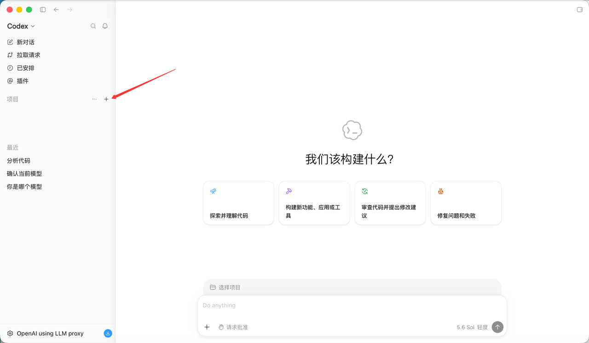
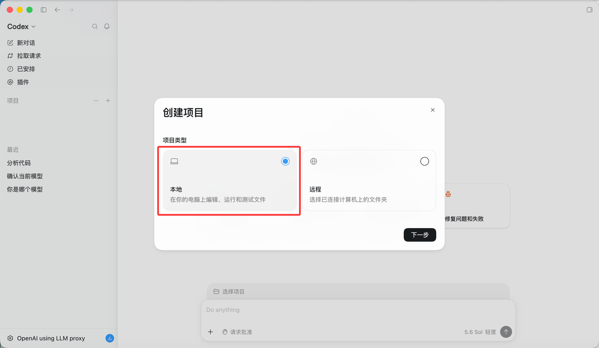
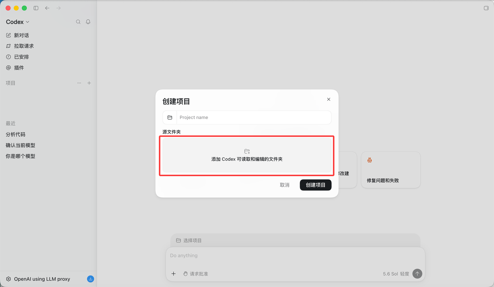
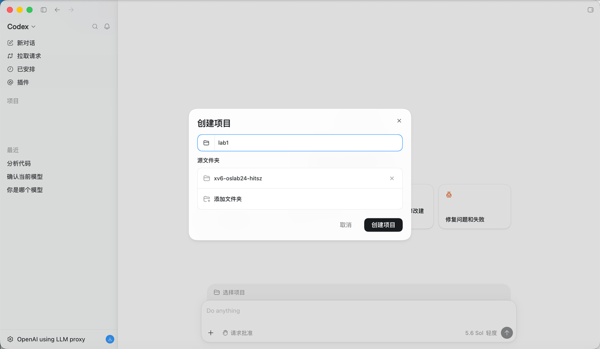
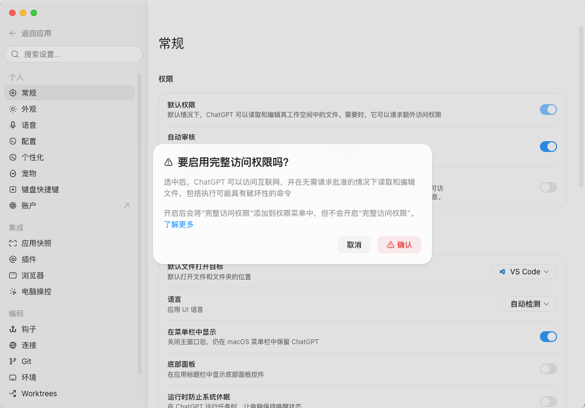
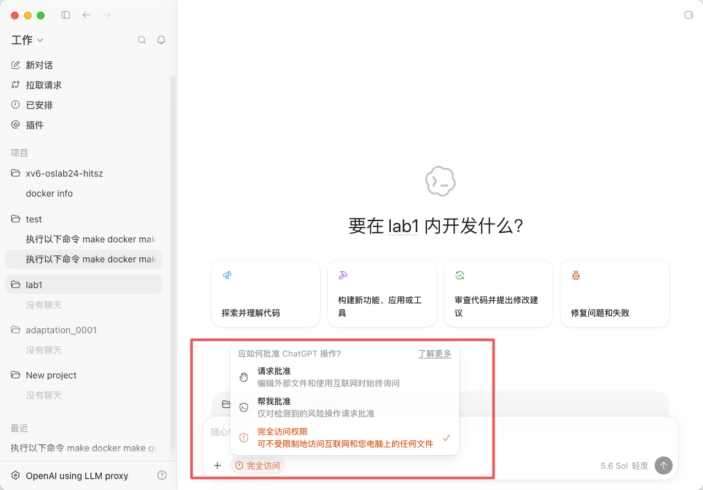

# 环境安装


## codex安装

本实验采用codex作为AI辅助开发环境。

1、下载codex

https://openai\.com/zh\-Hans\-CN/codex/

2、Api key设置

编辑文件：\~/\.codex/config\.toml

```Bash
model_provider = "proxy"

[model_providers.proxy]
name = "OpenAI using LLM proxy"
base_url = "http://192.168.10.1/v1"
experimental_bearer_token = "sk-xxxxxx"
```

name，填写模型提供商名字，任意

base\_url，填写安全岛的实际url，如http://192\.168\.10\.1/v1

experimental\_bearer\_token，填写安全岛的虚拟密钥

创建文件：\~/\.codex/auth\.json

```Bash
{
"auth_mode": "apikey",
"OPENAI_API_KEY": "sk-xxxxxxx" 对应的安全岛key
}
```

如果无法使用安全岛，可以直接使用deepseek的配置方式：https://api\-docs\.deepseek\.com/zh\-cn/quick\_start/agent\_integrations/codex


3、添加项目目录

点击\+号



项目类型选择“本地”。如果使用远程服务器，可以选择“远程”。



添加Codex可编辑的文件夹，也就是xv6\-oslab24\-hitsz文件夹。



Project name中填入“lab1”。然后点击“创建项目”。



**以下设置按需求而定，不是必须**

如果有一些执行一些特殊的命令（如：docker、rm等），那么需要要为codex打开最高权限







# 2.Python环境准备

## 2.1 软件下载

下载地址: https://www.anaconda.com/download/success

点击下载地址,根据自身电脑版本下载miniconda安装包

MacOS:


Windows


## 2.2 软件安装

双击安装包打开安装图形界面点击继续按钮


###### 附件: [安装参考视频](https://www.bilibili.com/video/BV1BFSJYEEj2/?spm_id_from=333.337.search-card.all.click&vd_source=99a1a0fc95d22736eceeb45b8bf76c45)

安装成功后打开终端会有一个base环境


## 2.3 创建自定义Python环境

1、打开终端


2、输入命令创建python版本,这里以python3.12版本为例

```Plain
conda create -n python_env python=3.12 -y
```


3、回车执行安装命令


4、等待界面提示  **conda activate python_env**  安装完成


5、执行conda命令切换已安装python环境

```Plain
conda activate python_env
```


6、命令终端显示已切换到python_env环境


7、终端输入查看Python版本验证,正确版本号为3.12

```Plain
 python -V 
```


#### 